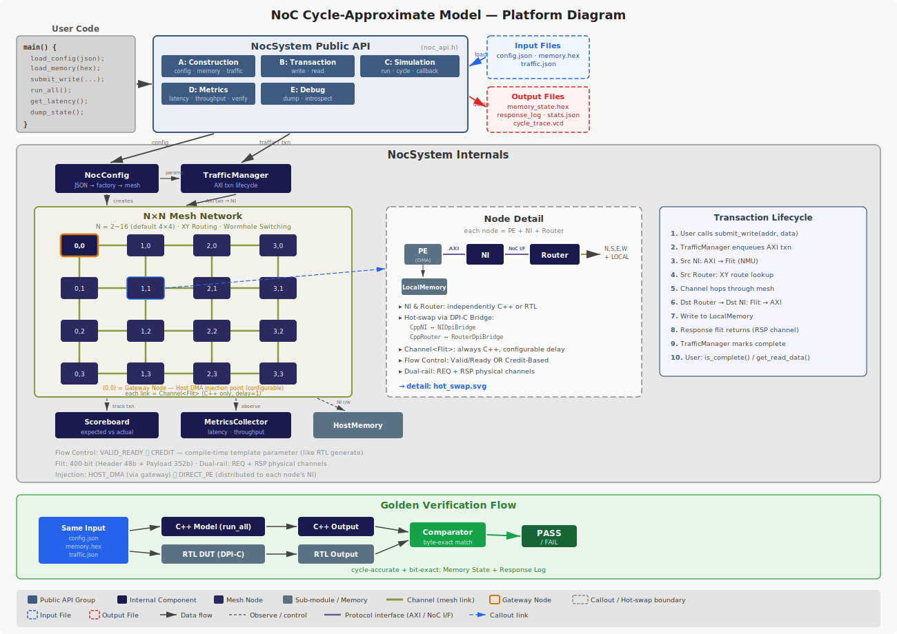

# System Architecture

本文件以圖表為主，提供 NoC Behavior Model 的全局架構視圖。

本專案建立 **NoC Virtual Behavior Model**，服務兩大目標：

| 目標 | 說明 |
|------|------|
| **Pre-silicon Performance Evaluation** | 高速模擬 NoC traffic，評估 latency / throughput / buffer occupancy |
| **RTL Co-simulation Golden Reference** | virtual model 的 output 作為 RTL 驗證的 bit-exact / cycle-accurate 比對基準 |

### Platform Summary

- **Purpose**：Pre-silicon performance evaluation + RTL co-simulation golden reference
- **API**：5 groups — Construction / Transaction / Simulation / Metrics / Debug
- **Mesh**：N×N (N=2\~16)，Node = PE → NI → Router，408-bit Flit，XY Routing + Wormhole
- **Hot-Swap**：NI & Router 可獨立替換為 RTL (DPI-C)，Channel 始終 virtual
- **Verification**：Scoreboard online per-txn 比對；virtual model vs RTL byte-exact match

> **Terminology**：本文件中「Virtual Router」和「Virtual NI」指 C++ behavior model 實作的元件（相對於 RTL 實作）。「Virtual Model」泛指整個 C++ behavior model。語言層面的 C++（如 C++ API、C++ test program）維持原稱。



---

## 1. NoC Hardware Architecture

### 1.1 Mesh Topology

```
  (0,3)════(1,3)════(2,3)════(3,3)
    ║        ║        ║        ║
   NI       NI       NI       NI
    ║        ║        ║        ║
  (0,2)════(1,2)════(2,2)════(3,2)
    ║        ║        ║        ║
   NI       NI       NI       NI
    ║        ║        ║        ║
  (0,1)════(1,1)════(2,1)════(3,1)
    ║        ║        ║        ║
   NI       NI       NI       NI
    ║        ║        ║        ║
  (0,0)════(1,0)════(2,0)════(3,0)
    ║        ║        ║        ║
   NI       NI       NI       NI

  ═══ = Router 間 link (Req/Rsp 各一條，雙向 full-duplex)
  (x,y) = Router，座標編碼為 8-bit node_id（[7:4]=y, [3:0]=x）
  NI = Network Interface，透過 Router LOCAL port 連接
```

預設 4×4 mesh（16 nodes），可配置 `MESH_COLS` / `MESH_ROWS`，最大支援 16×16 = 256 nodes。

### 1.2 Node 結構

每個 node 由 PE（Processing Element）+ NI + Router 組成。PE 含 DMA 與 local DRAM，透過 AXI 介面連接 NI：

```
  ┌───────────────── 一般 Node (x,y) ──────────────────────────┐
  │                                                             │
  │  ┌──── Local PE ─────────┐                                  │
  │  │  DMA + local DRAM     │                                  │
  │  │  (NUMA-capable)       │                                  │
  │  └──────────┬────────────┘                                  │
  │             │ AXI (Master/Slave)                             │
  │             ▼                                                │
  │  ┌──────────────────┐       ┌────────────────┐              │
  │  │   NI (NMU+NSU)   │◄─L──►│     Router     │◄══► Mesh     │
  │  │   port_id = 0    │      │   (N/S/E/W/L)  │     Links    │
  │  └──────────────────┘       └────────────────┘              │
  └─────────────────────────────────────────────────────────────┘

  ┌───────────────── Gateway Node (configurable) ──────────────┐
  │                                                             │
  │  ┌── Local PE ──┐   ┌── Host DMA ──────┐                   │
  │  │ DMA + DRAM   │   │ External Master   │                   │
  │  └──────┬───────┘   └──────┬────────────┘                   │
  │         │ AXI              │ AXI                            │
  │         ▼                  ▼                                 │
  │  NI (port_id=0)     NI (port_id=1)                          │
  │         └──────┬───────────┘                                 │
  │                ▼                                             │
  │  ┌────────────────────┐                                      │
  │  │  Router (≥2 LOCAL) │◄══► Mesh Links                      │
  │  └────────────────────┘                                      │
  └─────────────────────────────────────────────────────────────┘
```

- Gateway node 的 Router 至少使用 2 個 LOCAL port（`port_id` 2-bit 欄位區分）
- 哪個 node 作為 gateway 由 NocConfig 配置
- 每個 PE 的 DMA 可主動發起跨 node transaction（NUMA-like access）

### 1.3 Router 內部架構

每個 Router 由兩個結構對稱的 sub-router 組成，分別處理 Request 與 Response traffic：

```
  ┌──────────────────── Router (x,y) ────────────────────┐
  │                                                       │
  │  ┌─────────────── ReqRouter ────────────────────┐    │
  │  │  AW/W/AR flits                                │    │
  │  │                                               │    │
  │  │  N ──►┌─InBuf─┐    ┌─────────┐  ┌─OutBuf─┐──►N   │
  │  │  S ──►│depth=4│───►│ Crossbar│─►│depth=2│──►S   │
  │  │  E ──►│       │    │  (N×N)  │  │       │──►E   │
  │  │  W ──►│       │    │         │  │       │──►W   │
  │  │  L ──►└───────┘    └─────────┘  └───────┘──►L   │
  │  │          ↑              ↑                        │
  │  │     Path Lock      QoS-Aware                     │
  │  │     (Wormhole)    Arbiter                       │
  │  └─────────────────────────────────────────────────┘
  │                                                       │
  │  ┌─────────────── RspRouter ────────────────────┐    │
  │  │  B/R flits（結構與 ReqRouter 完全對稱）        │    │
  │  │  + In-Network Reduction（Multicast B 合併）    │    │
  │  └─────────────────────────────────────────────────┘
  │                                                       │
  └───────────────────────────────────────────────────────┘
```

### 1.4 Network Interface 內部架構

```
  ┌──────────────────── Network Interface ─────────────────────┐
  │                                                             │
  │  ┌───────────────── NMU (Network Master Unit) ──────────┐  │
  │  │                                                       │  │
  │  │  AXI Slave ──► Address Translator ──► QoS Generator ──► Flit Packer     │  │──► Req Router
  │  │  (AW/AR/W)     (XY offset    (Bypass/   (AXI→Flit    │  │
  │  │                 or SAM)      Fixed/      + ECC Gen)   │  │
  │  │                              Limiter/                 │  │
  │  │  AXI Slave ◄── RoB ◄──────── Flit Unpacker ◄── ECC Chk  │  │◄── Rsp Router
  │  │  (B/R)         (Reorder      (Flit→AXI)               │  │
  │  │                 Buffer)                                │  │
  │  └───────────────────────────────────────────────────────┘  │
  │                                                             │
  │  ┌───────────────── NSU (Network Slave Unit) ───────────┐  │
  │  │                                                       │  │
  │  │  Req Router ──► Flit Unpacker ──► Request Info Store           │  │
  │  │                 (Flit→AXI)     (Save src/qos/rob_idx) │  │
  │  │                                      │                │  │
  │  │                                      ▼                │  │
  │  │  Rsp Router ◄── Flit Packer ◄── AXI Response ◄── Memory │  │
  │  │                 (AXI→Flit     (B or R data)           │  │
  │  │                  + ECC Gen)                            │  │
  │  └───────────────────────────────────────────────────────┘  │
  │                                                             │
  └─────────────────────────────────────────────────────────────┘
```

---

## 2. Data Flow

### 2.1 Write Transaction（End-to-End）

```
  Source Node                        Mesh                      Destination Node
  ┌────────────┐                                               ┌────────────┐
  │ AXI Master │                                               │   Local    │
  │   (CPU)    │                                               │  Memory    │
  └─────┬──────┘                                               └─────▲──────┘
        │ AW + W beats                                               │ Write data
        ▼                                                            │
  ┌─────────────┐    ┌──────────────────────────────────┐    ┌──────┴──────┐
  │     NMU     │    │          Request Network          │    │     NSU     │
  │ Address Translator   │    │                                    │    │ Flit Unpacker  │
  │ QoS Generator      │───►│ [AW flit]──►Router──►Router──►───│───►│ Reassembly  │
  │ Flit Packer    │    │ [W flit 0]──►  ↓       ↓    ───│───►│ → AXI W     │
  │ ECC Gen     │    │ [W flit N]──►  XY Routing   ───│───►│ → Memory Wr │
  └─────▲───────┘    └──────────────────────────────────┘    └─────────────┘
        │                                                            │
        │ AXI B resp                                                 │ B resp
        │                                                            ▼
  ┌─────┴───────┐    ┌──────────────────────────────────┐    ┌─────────────┐
  │     NMU     │    │         Response Network          │    │     NSU     │
  │ Flit Unpacker  │◄──│◄───Router◄───Router◄──[B flit]◄──│◄───│ Flit Packer    │
  │ RoB release │    │    XY Routing (reverse)           │    │ ECC Gen     │
  │ → AXI B     │    └──────────────────────────────────┘    └─────────────┘
  └─────────────┘
```

### 2.2 Read Transaction（End-to-End）

```
  Source Node                        Mesh                      Destination Node
  ┌────────────┐                                               ┌────────────┐
  │ AXI Master │                                               │   Local    │
  │   (CPU)    │                                               │  Memory    │
  └─────┬──────┘                                               └─────┬──────┘
        │ AR                                                         │ Read data
        ▼                                                            ▼
  ┌─────────────┐    ┌──────────────────────────────────┐    ┌─────────────┐
  │     NMU     │    │          Request Network          │    │     NSU     │
  │ Flit Packer    │───►│ [AR flit]──►Router──►Router──►───│───►│ Flit Unpacker  │
  │ ECC Gen     │    │    XY Routing                     │    │ → AXI AR   │
  └─────▲───────┘    └──────────────────────────────────┘    │ → Memory Rd │
        │                                                     └─────────────┘
        │ AXI R data                                                 │
        │                                                            ▼
  ┌─────┴───────┐    ┌──────────────────────────────────┐    ┌─────────────┐
  │     NMU     │    │         Response Network          │    │     NSU     │
  │ Flit Unpacker  │◄──│◄───Router◄───Router◄──[R flit 0] │◄───│ Flit Packer    │
  │ RoB match   │    │                    ◄──[R flit N] │    │ ECC Gen     │
  │ → AXI R     │    └──────────────────────────────────┘    └─────────────┘
  └─────────────┘
```

### 2.3 Flit 傳輸單位

所有 data flow 使用統一的 408-bit flit（56-bit header + 352-bit payload）。一個 AXI transaction 在 NoC 中映射為一或多個 flit：

| AXI Transaction | Request Flits | Response Flits |
|-----------------|:-------------:|:--------------:|
| Write (awlen=0) | 1 AW + 1 W = 2 | 1 B |
| Write (awlen=N) | 1 AW + (N+1) W | 1 B |
| Read (arlen=0) | 1 AR | 1 R |
| Read (arlen=N) | 1 AR | (N+1) R |

---

## 3. Software / Hardware Interface

### 3.1 Virtual Model Software / Hardware Architecture

```
┌─────────────────────────────────────────────────────────────────────────┐
│ User Code                                                                 │
│                                                                          │
│   C++ test program    │   SV testbench    │   Python script              │
│   (standalone sim)    │   (co-sim)        │   (batch run)                │
└───────────┬───────────┴─────────┬─────────┴──────────────────────────────┘
            │ C++ API             │ DPI-C
            ▼                     ▼
┌─────────────────────────────────────────────────────────────────────────┐
│ NoC System Public API (noc_api.h)                                         │
│                                                                          │
│  Group A          Group B          Group C                               │
│  Construction     Transaction      Simulation                            │
│  load_config()    submit_write()   process_cycle()                       │
│  load_memory()    submit_read()    run(N)                                │
│  load_traffic()   submit_mcast()   run_until_idle()                      │
│                   is_complete()    run_all()                              │
│                   get_read_data()                                        │
│  Group D          Group E                                                │
│  Metrics          Debug & Output                                         │
│  get_metrics()    get_router()     dump_state()    generate_golden()     │
│  verify()         get_ni()         dump_memory()   dump_response_log()   │
└───────────────────────────┬─────────────────────────────────────────────┘
                            │ delegates to
                            ▼
┌─────────────────────────────────────────────────────────────────────────┐
│ Internal Components                                                      │
│                                                                          │
│  ┌────────────────┐  ┌───────────────────────────────────────────────┐  │
│  │ Traffic Manager │  │                    Mesh                       │  │
│  │ AXI txn submit │  │  ┌────────┐ Channel<T> ┌────────┐            │  │
│  │ HOST_DMA or    │─►│  │ Router │◄══════════►│ Router │◄══► ...    │  │
│  │ DIRECT_PE mode │  │  └───┬────┘  (delay=1) └────────┘            │  │
│  └───────┬────────┘  │      │ LOCAL port(s)                          │  │
│          │AXI txn    │  ┌───┴──┐                                     │  │
│  ┌───────┴────────┐  │  │  NI  │◄──► PE (DMA + DRAM)                │  │
│  │ Scoreboard  │  │  └──────┘                                     │  │
│  │ MetricsCollect.│  │                                               │  │
│  │ Host Memory     │  └───────────────────────────────────────────────┘  │
│  └────────────────┘                                                      │
│                                                                          │
│  ┌───────────────── HOT-SWAP BOUNDARY ─────────────────────────────┐   │
│  │  Virtual Router  ◄─── Router_Interface<Mode> ───► Router DPI Bridge     │   │
│  │  Virtual NI      ◄─── NI_Interface<Mode>    ───► NI DPI Bridge          │   │
│  └──────────────────────────────────────────────────────────────────┘   │
└───────────────────────────┬─────────────────────────────────────────────┘
                            │ DPI-C
                            ▼
┌─────────────────────────────────────────────────────────────────────────┐
│ Co-Sim Bridge + RTL                                                      │
│                                                                          │
│  Signal-Level DPI-C           RTL Modules (SystemVerilog)                │
│  noc_set_port_input()         RTL Router × N                             │
│  noc_get_port_output()        RTL NI × N                                 │
│  (per-cycle flit exchange)    RTL Memory                                 │
└─────────────────────────────────────────────────────────────────────────┘
```

### 3.2 Abstract Interface（軟硬體邊界）

virtual model 與 RTL 的替換邊界定義在 `Router_Interface<Mode>` 和 `NI_Interface<Mode>`：

```
  Pure Virtual Simulation                     Co-Simulation (Hot-Swap)

  ┌─────────┐  ┌─────────┐              ┌─────────┐  ┌─────────────┐
  │Virtual Router│  │Virtual Router│              │Virtual Router│  │Router DPI Bridge│
  └────┬────┘  └────┬────┘              └────┬────┘  └──────┬───────┘
       │ Channel    │                        │ Channel      │ DPI-C
  ┌────┴────┐  ┌────┴────┐              ┌────┴────┐  ┌──────┴───────┐
  │  Virtual NI  │  │  Virtual NI  │              │  Virtual NI  │  │  RTL NI (SV) │
  └─────────┘  └─────────┘              └─────────┘  └──────────────┘

  全部 virtual 實作                           混合：一個 Router 替換為 RTL
  高速模擬                               驗證 RTL Router 正確性
```

Interface 合約確保 virtual 與 RTL 實作的行為一致。替換粒度為單一 Router 或 NI，不需改動 Mesh wiring。

### 3.3 Physical Link 信號

每條 Router ↔ Router / NI ↔ Router link 的信號定義：

```
  410 bits per direction:
  ┌──────────────────────────────────────────────────────┬───────┬───────┐
  │                 flit (408 bits)                       │ ready │ valid │
  │         header (56b)  +  payload (352b)              │  (1b) │  (1b) │
  └──────────────────────────────────────────────────────┴───────┴───────┘

  Router A ════════[410b Req fwd]════════► Router B
  Router A ◄═══════[410b Req rev]═════════ Router B
  Router A ════════[410b Rsp fwd]════════► Router B
  Router A ◄═══════[410b Rsp rev]═════════ Router B
                 Total: 4 × 410 = 1,640 bits per router pair
```

---

## 4. I/O Pattern & Golden Verification

### 4.1 Golden Verification Flow

同一組 input pattern 分別餵入 virtual model 和 RTL，virtual model output 為 golden，與 RTL output 比對：

```
                    ┌─────────────────┐
                    │  Input Patterns  │
                    │  ┌─────────────┐│
                    │  │ config.json ││
                    │  │ memory/*.hex││
                    │  │ traffic.json││
                    │  │ wdata/*.hex ││
                    │  └─────────────┘│
                    └────────┬────────┘
                             │
                ┌────────────┴────────────┐
                │                         │
                ▼                         ▼
  ┌──────────────────────┐  ┌──────────────────────┐
  │    Virtual NoC Model     │  │   RTL Simulation     │
  │                      │  │                      │
  │  load_config()       │  │  DPI-C / $readmemh   │
  │  load_memory()       │  │  AXI driver          │
  │  load_traffic()      │  │  RTL NoC (DUT)       │
  │  run_all()           │  │  run simulation      │
  │  generate_golden()   │  │  dump outputs        │
  └──────────┬───────────┘  └──────────┬───────────┘
             │                         │
             ▼                         ▼
  ┌──────────────────┐      ┌──────────────────┐
  │  Golden Output   │      │  Actual Output   │
  │  memory_state.hex│      │  memory_state.hex│
  │  response_log.json      │  response_log.json
  │  (cycle_trace.vcd)│     │  (cycle_trace.vcd)│
  │  (statistics.json)│     │                  │
  └────────┬─────────┘      └────────┬─────────┘
           │                         │
           └──────────┬──────────────┘
                      ▼
              ┌──────────────┐
              │  Comparator  │
              │              │
              │  Memory:     │
              │   byte-exact │
              │  Response:   │
              │   cycle-     │
              │   accurate*  │
              └──────┬───────┘
                     │
               PASS / FAIL
               + diff report
```

> *Cycle-accurate match 前提：NocConfig pipeline delay 與 RTL pipeline 深度正確校準。

### 4.2 I/O Pattern 總覽

| Direction | Pattern | Format | Content | Golden Compare |
|:---------:|---------|--------|---------|:--------------:|
| INPUT | Config | `.json` | Mesh 大小、buffer depth、flow control | — |
| INPUT | Memory Init | `.hex` | 各 node 初始 memory 內容 | — |
| INPUT | Traffic | `.json` + `.hex` | AXI transaction 序列 + write data | — |
| OUTPUT | Memory State | `.hex` | 所有 transaction 完成後各 node memory dump | byte-exact |
| OUTPUT | Response Log | `.json` + `.hex` | 每筆 transaction 的 response + read data | cycle-accurate |
| OUTPUT | Cycle Trace | `.vcd` / `.json` | 每 cycle router/NI/channel 狀態 | debug only |
| OUTPUT | Statistics | `.json` | latency / throughput / buffer occupancy | derived |

### 4.3 Golden Data 來源

```
  Write Verification:
    Source Memory ──(1) capture data──► Scoreboard
         │                                    │
         │ (2) Transfer via Mesh              │ (3) Compare
         ▼                                    ▼
    Dest Local Memory ──(actual)──────► PASS / FAIL

  Read Verification:
    Source Local Memory ──(1) capture data──► Scoreboard
         │                                       │
         │ (2) Transfer via Mesh                 │ (3) Compare
         ▼                                       ▼
    NMU RoB (response data) ──(actual)───► PASS / FAIL
```

---

## 5. Co-Simulation Architecture

### 5.1 Substitution Modes

```
  Mode 1: Pure Virtual (Performance Eval)      Mode 2: NI RTL Verification
  ┌──────────────────────────────┐         ┌──────────────────────────────┐
  │  All Virtual Router + All Virtual NI  │         │  All Virtual Router              │
  │  ───────────────────────     │         │  + NI DPI Bridge (DPI-C ↔ SV) │
  │  No RTL, maximum speed      │         │  Verify NI RTL              │
  └──────────────────────────────┘         └──────────────────────────────┘

  Mode 3: Router RTL Verification          Mode 4: Full RTL Co-Sim
  ┌──────────────────────────────┐         ┌──────────────────────────────┐
  │  Router DPI Bridge (DPI-C ↔ SV)│         │  All Router DPI Bridge         │
  │  + All Virtual NI                │         │  + All NI DPI Bridge           │
  │  Verify Router RTL          │         │  Full system co-sim         │
  └──────────────────────────────┘         └──────────────────────────────┘
```

### 5.2 DPI-C Bridge 架構（Signal-Level）

virtual model 為主控方。當某個 Virtual Router/Virtual NI 被替換為 RTL 時，DPI-C Bridge 透過 Signal-Level DPI-C 每 cycle 與 RTL module 交換 port 信號：

```
  Virtual NoC Model (主控)                      SystemVerilog Simulator
  ┌──────────────────────┐                  ┌──────────────────────┐
  │                      │   Signal-Level   │                      │
  │  Router DPI Bridge      │   DPI-C          │  RTL Router          │
  │  ──────────────      │  ┌──────────┐    │  ──────────          │
  │  tick() ─────────────│─►│noc_set   │───►│  port input signals  │
  │                      │  │_port_input│    │                      │
  │  post_wire() ◄───────│──│noc_get   │◄───│  port output signals │
  │                      │  │_port_out │    │                      │
  │                      │  └──────────┘    │                      │
  │  NI DPI Bridge          │                  │  RTL NI              │
  │  ──────────          │  ┌──────────┐    │  ──────              │
  │  tick() ─────────────│─►│noc_set   │───►│  port input signals  │
  │  post_wire() ◄───────│──│noc_get   │◄───│  port output signals │
  │                      │  └──────────┘    │                      │
  └──────────────────────┘                  └──────────────────────┘

  每 cycle 交換：flit (408b) + valid (1b) + ready (1b) + credit
```

---

## 6. 8-Phase Simulation Cycle

virtual model 將 RTL 的並行行為拆為 8 個循序 phase，以 ordering 保證因果正確（詳細 Phase 4 state machine 與 credit 時序見 [Simulation Platform](08_simulation.md) §6）：

```
  ┌─── Cycle N ──────────────────────────────────────────────────────────┐
  │                                                                       │
  │  Phase 1: Sample         in_valid && out_ready → push to buffer      │
  │  Phase 2: Clear Inputs   防止重複 sample                              │
  │  Phase 3: Update Ready   out_ready = !buffer.full()                  │
  │  Phase 4: Route & Forward RC→VA→SA→ST pipeline + credit return 產生   │
  │  Phase 5: Wire All       Channel<T> 交換 output → 對端 input         │
  │  Phase 6: Clear Accepted  out_valid && in_ready → 清除 output        │
  │  Phase 7: Credit Update  上游收到 credit → counter +1                 │
  │  Phase 8: NI Process     NMU/NSU AXI ↔ flit conversion              │
  │                                                                       │
  └───────────────────────────────────────────────────────────────────────┘

  RTL Mapping:
  ┌────────────────────────┬──────────────────────────────────┐
  │ RTL posedge clk        │ Virtual Phase                    │
  ├────────────────────────┼──────────────────────────────────┤
  │ Input FF latch         │ Phase 1 (Sample)                 │
  │ Output FF update       │ Phase 6 (Clear Accepted)         │
  │ Credit counter update  │ Phase 7 (Credit Update)          │
  ├────────────────────────┼──────────────────────────────────┤
  │ Combinational logic    │ Phase 3 (Ready) + Phase 4 (Pipe) │
  │ Wire propagation       │ Phase 5 (Wire All)               │
  └────────────────────────┴──────────────────────────────────┘
```

---

## 7. Component Function Definitions

以下定義每個元件的 public / internal function。

### 7.1 NoC System Public API

5 組 API，詳見 [Simulation Platform](08_simulation.md)。

| Group | Function | 說明 |
|-------|----------|------|
| **A: Construction** | `NoC System(config)` | 根據 NocConfig 建構整個 Mesh |
| | `load_host_memory(addr, data, len)` | 載入 Host Memory |
| | `load_local_memory(node_id, addr, data, len)` | 載入指定 node 的 Local Memory |
| | `dump_local_memory(node_id, addr, buf, len)` | 傾印 Local Memory |
| **B: Transaction** | `submit_write(addr, data, len, axi_id)` → `TxnHandle` | 提交 write transaction |
| | `submit_read(addr, len, axi_id)` → `TxnHandle` | 提交 read transaction |
| | `submit_multicast_write(addr, data, len, dst_nodes)` → `TxnHandle` | 提交 multicast write |
| | `is_complete(handle)` | 查詢 transaction 完成狀態 |
| | `all_complete()` | 所有 transaction 是否完成 |
| | `get_status(handle)` → `TxnStatus` | 取得 PENDING/COMPLETE/ERROR |
| | `get_read_data(handle)` | 取得 read response data |
| | `set_completion_callback(cb)` | 註冊 completion 回呼 |
| **C: Simulation** | `process_cycle()` | 執行 1 cycle（8 phases） |
| | `run(N)` | 執行 N cycles |
| | `run_until_idle(max_cycles)` | 執行直到 network idle |
| | `run_all()` | load_traffic + run_until_idle |
| | `current_cycle()` | 回傳目前 cycle 數 |
| **D: Metrics** | `get_metrics()` | 取得 Metrics Collector 參照 |
| | `verify()` | 執行 golden 驗證 |
| **E: Debug** | `get_router(coord)` | 存取特定 Router（read-only） |
| | `get_ni(coord)` | 存取特定 NI（read-only） |
| | `dump_state(os)` | 傾印全系統狀態 |
| | `generate_golden(dir)` | 產生所有 golden output |
| | `dump_response_log(path)` | 傾印 response log |

### 7.2 Traffic Manager

模擬 Host DMA / PE DMA 的行為，管理 AXI transaction lifecycle。Traffic Manager 送出的是 **AXI transaction**（addr, data, len），由 NI 的 NMU 負責 AXI → flit 轉換。

支援兩種 injection 模式（memory init 同理）：

| 模式 | 說明 |
|------|------|
| `HOST_DMA` | 所有 transaction 集中從 gateway node 的 Host DMA NI（`port_id=1`）注入 |
| `DIRECT_PE` | 各 transaction 按 `src_node` 分發到對應 PE 的 NI（`port_id=0`）直接注入 |

| Visibility | Function | 說明 |
|------------|----------|------|
| public | `set_injection_mode(HOST_DMA / DIRECT_PE)` | 設定 injection 模式 |
| public | `set_gateway_node(node_id, port_id)` | 指定 HOST_DMA 模式的 gateway |
| public | `submit_write(addr, data, len, axi_id)` → `TxnHandle` | 提交 AXI write transaction |
| public | `submit_read(addr, len, axi_id)` → `TxnHandle` | 提交 AXI read transaction |
| public | `tick(current_cycle)` | 每 cycle：送 AXI txn → NI，collect completions |
| public | `is_complete(handle)` | 查詢完成狀態 |
| public | `get_status(handle)` → `TxnStatus` | 取得狀態 |
| public | `get_read_data(handle)` | 取得 read data |
| internal | `schedule_injection()` | 從 pending queue 排程，依 mode 選擇目標 NI |
| internal | `collect_completion()` | 從 NMU 收集 completion |

### 7.3 Scoreboard

Online 追蹤每筆 transaction 的 expected vs actual outcome。Submit 時記錄 expected，response 到達時即時比對。

| Function | 說明 |
|----------|------|
| `register_expected(txn_handle, addr, data, len)` | Submit 時記錄 expected outcome |
| `check_actual(txn_handle, actual_data)` | Response 到達時即時比對 |
| `get_result(txn_handle)` | 取得單筆 txn 比對結果 |
| `get_summary()` | 取得整體 PASS/FAIL 統計 |
| `detect_collision(addr, len)` | 偵測 address collision（同位址多次寫入） |

### 7.4 Metrics Collector

收集 per-node / per-transaction 效能指標。

| Function | 說明 |
|----------|------|
| `capture(event)` | 記錄通用事件 |
| `record_injection(node, cycle)` | 記錄 flit injection 時間 |
| `record_ejection(node, cycle)` | 記錄 flit ejection 時間 |
| `get_latency_stats()` | 取得 latency 統計（min/max/avg） |
| `get_throughput_stats()` | 取得 throughput 統計 |
| `get_buffer_stats()` | 取得 buffer occupancy 統計 |
| `dump_json(path)` | 輸出 statistics JSON |

### 7.5 Virtual Router（Router_Interface\<Mode\>）

詳見 [Router](03_router.md)。

| Visibility | Function | 說明 |
|------------|----------|------|
| **public** | `tick()` | 執行 Phase 1~4 pipeline |
| | `post_wire()` | 執行 Phase 6~7（clear accepted + credit update） |
| | `get_output(port, ch)` → `PortOutput<Mode>` | Phase 5 取得 output flit |
| | `set_input(port, ch, data)` | Phase 5 設定 input flit |
| | `num_ports()` | 回傳 port 數 (3~5) |
| **pipeline** | `_input_queuing()` | Sample inputs → push to Input Buffer |
| | `_route_evaluate()` | XY route computation（HEAD flit only） |
| | `_vc_alloc_evaluate()` | VC allocation（Credit-Based mode only） |
| | `_sw_alloc_evaluate()` | Switch arbitration（QoS-Aware RR） |
| | `_switch_traverse()` | Crossbar traversal |
| | `_output_queuing()` | Write to Output Buffer |
| **sub-module** | `Input Buffer` | per-port FIFO（depth = config） |
| | `Buffer State` | Credit tracking（與 Buffer 分離） |
| | `Route Computer` | XY routing + multicast RCR |
| | `Crossbar` | N×N switch fabric |
| | `Path Lock` | Wormhole path locking FSM |
| | `Allocator` | Pluggable: Round Robin / iSLIP / QoS-Aware RR |
| | `Multicast Tracker` | Multicast fork tracking |
| | `Reduction Sync` / `Reduction Arbiter` | In-network reduction（B response 合併） |

### 7.6 Virtual NI（NI_Interface\<Mode\>）

詳見 [Network Interface](04_network_interface.md)。

| Visibility | Function | 說明 |
|------------|----------|------|
| **public** | `tick()` | Phase 8: NMU + NSU processing |
| | `get_output(ch)` → `PortOutput<Mode>` | 取得 NI → Router output |
| | `set_input(ch, data)` | 設定 Router → NI input |
| **NMU** | `_addr_translate(addr)` | XY offset 或 SAM-based 地址轉換 |
| | `_qos_generate(hdr)` | 產生 QoS 優先級（Bypass/Fixed/Limiter/Regulator） |
| | `_pack_aw(req)` | AXI AW → flit |
| | `_pack_w(data)` | AXI W → flit(s) |
| | `_pack_ar(req)` | AXI AR → flit |
| | `_ecc_generate(flit)` | SECDED ECC 產生 |
| | `_inject()` | Injection buffer → network |
| | `_unpack_b(flit)` | flit → AXI B response |
| | `_unpack_r(flit)` | flit → AXI R response |
| | `_alloc_rob(txn)` | 分配 RoB entry |
| | `_release_rob(idx)` | 釋放 RoB entry |
| **NSU** | `_unpack_aw(flit)` | flit → AXI AW |
| | `_unpack_ar(flit)` | flit → AXI AR |
| | `_unpack_w(flit)` | flit → AXI W（burst reassembly） |
| | `_reassemble()` | W burst 重組完成檢查 |
| | `_ecc_check(flit)` | SECDED ECC 驗證 |
| | `_pack_b(resp)` | AXI B → flit |
| | `_pack_r(data)` | AXI R → flit(s) |
| | `_store_req_info(info)` | 儲存 src/qos/rob_idx 供 response 使用 |
| | `_memory_op(req)` | 執行 Local Memory read/write |
| **sub-module** | `Injection Buffer` | NMU → network FIFO（req/rsp 各一） |
| | `Reorder Buffer (RoB)` | NMU response reordering |
| | `Reassembly Buffer` | NSU W burst reassembly |
| | `Request Info Store` | NSU 暫存 request metadata |
| | `Local Memory` | Per-node flat memory |

### 7.7 Channel\<T\>

帶有可配置延遲的 link model，取代 zero-cycle wire_all()。

| Function | 說明 |
|----------|------|
| `Send(data)` | Sender 端寫入 data |
| `Receive()` → `PortOutput<Mode>` | Receiver 端讀取（delay cycles 後可用） |
| `HasData()` | 是否有 data 可讀 |
| `ReadInputs()` | Latch incoming data |
| `WriteOutputs()` | Shift delay pipeline, output oldest |

### 7.8 Allocator（Abstract Base）

Pluggable arbiter，由 config string 選擇具體實作。

| Function | 說明 |
|----------|------|
| `allocate(requests, grants)` | 根據 requests 決定 grants |
| **實作** | |
| `Round Robin` | 基本輪詢 |
| `iSLIP` | Iterative round-robin matching |
| `QoS-Aware RR` | QoS priority + RR tie-break |

### 7.9 Input Buffer / Buffer State

Buffer 與 credit tracking 分離（booksim2 pattern）。

| Component | Function | 說明 |
|-----------|----------|------|
| **Input Buffer** | `push(flit)` | 寫入 flit |
| | `pop()` → `Flit` | 讀出 flit |
| | `peek()` → `Flit` | 查看 head flit |
| | `full()` / `empty()` | 狀態查詢 |
| **Buffer State** | `consume_credit()` | 消耗一個 credit（發送 flit） |
| | `release_credit()` | 釋放一個 credit（對端消化 flit） |
| | `has_credit()` | 是否有可用 credit |

### 7.10 Route Computer

| Function | 說明 |
|----------|------|
| `compute_route(src, dst)` → `Port` | XY routing：X-first then Y |
| `compute_multicast(src, bbox)` → `PortSet` | Rectangle bounding box multicast routing |

### 7.11 Memory

| Component | Function | 說明 |
|-----------|----------|------|
| **Host Memory** | `read(addr, buf, len)` | 讀取 host memory |
| | `write(addr, data, len)` | 寫入 host memory |
| | `load_hex(path)` | 從 .hex 檔載入 |
| | `dump_hex(path)` | 傾印至 .hex 檔 |
| **Local Memory** | `read(addr, buf, len)` | 讀取 local memory |
| | `write(addr, data, len)` | 寫入 local memory |
| | `load_hex(path)` | 從 .hex 檔載入 |
| | `dump_hex(path)` | 傾印至 .hex 檔 |

---

## 8. Key Design Features

| Feature | Mechanism | Reference |
|---------|-----------|-----------|
| XY Routing | Deterministic, X-first then Y, deadlock-free | [Router](03_router.md) |
| Wormhole Switching | Head flit locks path, `last` bit releases | [Router](03_router.md) |
| Dual Flow Control | Valid/Ready (Ver A) or Credit-Based (Ver B) | [Physical Channel](05_physical_channel.md) |
| Req/Rsp Separation | 獨立 physical link，消除 protocol deadlock | [Physical Channel](05_physical_channel.md) |
| QoS-Aware Arbitration | 16-level priority + Round-Robin tie-break | [QoS](06_qos.md) |
| ECC Protection | SECDED end-to-end (NMU generate, NSU check) | [NI](04_network_interface.md) |
| Multicast | Rectangle bounding box + in-network B reduction | [Multicast](07_multicast.md) |
| Reorder Buffer | Per-NMU RoB, out-of-order response support | [NI](04_network_interface.md) |
| Hot-Swap | Router/NI 可替換為 RTL proxy (DPI-C) | [Simulation](08_simulation.md) |

---

## 9. Architecture Diagram

架構由左到右分為 4 欄，對應 User Code → Public API → Internal Components → Co-Sim Bridge。以下逐欄說明。

### 9.1 第 1 欄：User Code（灰底）

使用者撰寫的 C++ 測試程式，不屬於 NoC model 本身。由上到下 4 個區塊：

| 區塊 | 用途 | 資料流 |
|------|------|--------|
| **main()** | 呼叫 NoC System API 的程式碼範例 | → 右（進入 API Group A/B/C） |
| **Input Patterns** | `config.json`、`memory/*.hex`、`traffic.json` | → 右（餵入 Group A） |
| **Callback** | `on_complete(handle, status)` | ← 左（從 Group B 回來） |
| **Golden Output** | `memory_state.hex`、`response_log.json`、`cycle_trace.vcd`、`statistics.json` | ← 左（從 Group E 產出），同時底部繞線 → 右到 Comparator |

### 9.2 第 2 欄：NoC Virtual Model & API（藍底）

分為**上半部**（API + 管理元件）和**下半部**（Mesh 硬體模型）。

#### 上半部左側 — NoC System API（5 組）

垂直排列 Group A~E，對應 `noc_api.h` 的 public interface：

| Group | 左側連線（User Code） | 右側連線（Internal） | 說明 |
|-------|----------------------|---------------------|------|
| A: Construction | ← main() + Input Patterns | → Traffic Manager (`load_traffic`)、→ Local Memory (`load_memory`，虛線) | 建構系統、載入配置與初始資料 |
| B: Transaction | ← main()、→ Callback (`complete/data`) | → Traffic Manager (`submit`)、← Traffic Manager (`is_complete/get_read_data`) | submit_write / submit_read / completion 查詢 |
| C: Simulation | ← main() | → Traffic Manager (`tick()`) | run(N) / run_all → 每 cycle 驅動 |
| D: Metrics | — | → Scoreboard (`verify()`)、→ Metrics Collector (`get_metrics()`)（虛線） | 驗證與效能查詢 |
| E: Debug | → Golden Output (`generate_golden`) | → Mesh (`get_router/get_ni`，虛線)、→ Scoreboard (`generate_golden()`) | 輸出 golden、introspection |

#### 上半部右側 — 3 個管理元件

| 元件 | 角色 | 關鍵連線 |
|------|------|---------|
| **Traffic Manager** | 模擬 Host DMA / PE DMA，接收 AXI transaction（非 flit）。黃色高亮 `set_injection_mode(HOST_DMA | DIRECT_PE)` 切換注入模式。內含 Pending AXI Txn Queue | API B/C → 此處 → (AXI txn) → Mesh NI |
| **Scoreboard** | Online 追蹤 expected vs actual per-txn | ← Traffic Manager register（橘色箭頭） |
| **Metrics Collector** | 記錄 injection/ejection 時間、latency 統計 | ← Traffic Manager stats |

#### 下半部 — Mesh（深藍底大方塊）

Mesh 內由上到下分 3 層：

**層 1：Single Node Detail**

展示單一 node 內部結構，由左到右：

```
  Local PE ──AXI(port_id=0)──► NI (NMU+NSU) ──Channel<T>──► Router ──► N/S/E/W mesh links
  (紫色)                        (綠色)          Req→/←Rsp     (藍色)

  Host DMA ──AXI(port_id=1)──► NI   （橘色虛線框，僅 gateway node）
```

- **Local PE**（紫色）：DMA + local DRAM，每個 node 都有，可發起跨 node transaction（NUMA-like）
- **Host DMA**（橘色虛線框）：僅 gateway node 才有，使用額外的 LOCAL port（`port_id=1`）
- **NI**（綠色）：NMU 將 AXI 轉為 flit，NSU 將 flit 轉為 AXI + 存取 local memory
- **Channel\<T\>**（橘色小方塊）：NI 與 Router 之間帶延遲的 link model，標示 Req→ / ←Rsp
- **Router**（藍色）：N/S/E/W + LOCAL port(s)，`port_id [1:0]` 區分多個 LOCAL port

**層 2：Virtual Router + Virtual NI 展開**

並排兩個大方塊，展示 virtual 實作的階層結構：

| 元件 | 層次 | 內容 |
|------|------|------|
| **Virtual Router** | Public | `tick()` Phase 1-4、`post_wire()` Phase 6-7、`get_output()/set_input()` |
| | Pipeline | 6 stage：InputQueuing → RouteEval → VCAllocEval → SWAllocEval → SwitchTraverse → OutputQueue |
| | Sub-Modules | Input Buffer、Buffer State、Route Computer、Crossbar、Path Lock、Allocator、Multicast Tracker、Reduction Sync/Arb |
| **Virtual NI** | Public | `tick()` Phase 8、`get_output()/set_input()` |
| | NMU | Address Translatorlate → QosGenerate → PackAW/W/AR → ECC Generator → Inject + UnpackB/R + AllocRoB |
| | NSU | UnpackAW/AR/W → Reassemble → ECC Checker → PackB/R + StoreReqInfo + MemoryOp |
| | Sub-Modules | Injection Buffer、RoB、Reassembly Buffer、Request Info Store |

**層 3：HOT-SWAP BOUNDARY + 共用元件**

- **HOT-SWAP BOUNDARY**（橘色虛線框）：Virtual Router/Virtual NI 可替換為 Router DPI Bridge/NI DPI Bridge，使用相同的 `Interface<Mode>`
- **Channel\<T\>**：Send / Receive / ReadInputs / WriteOutputs
- **Host Memory / Local Memory**：read / write / load_hex / dump_hex
- **Allocator**：pluggable — Round Robin / iSLIP / QoS-Aware RR

### 9.3 第 3 欄：DPI-C Bridge（綠底）

DPI-C Bridge 只有一條路徑：**Signal-Level**，作為 Hot-Swap 的唯一通道。

| 項目 | 說明 |
|------|------|
| **誰呼叫** | Router DPI Bridge / NI DPI Bridge（C++ 側的 proxy） |
| **用途** | 替換 Virtual Router/Virtual NI 為 RTL 時，proxy **每 cycle** 與 RTL module 交換 port 信號 |
| **資料粒度** | 每 cycle 的 flit + valid / ready / credit |
| **Functions** | `noc_set_port_input(node,port,ch,valid,flit,crdt)`、`noc_get_port_output(...)` |
| **連線** | ← 左方 Hot-Swap Boundary（橘色粗箭頭），→ 右方 RTL Router / RTL NI（橘色粗箭頭） |

**替換流程**（圖中方塊內有示意）：

```
Virtual Router.tick()
    ↓ replaced by
Router DPI Bridge.tick()
    ↓ calls DPI-C
noc_set/get_port_*()
    ↓ drives
RTL Router (SV)
```

### 9.4 第 4 欄：RTL（橘底）

| 區塊 | 位置 | 內容 |
|------|------|------|
| **RTL Router (SV)** | 對齊 Signal-Level DPI-C | input_buffer、route_compute、vc/sw_allocator、crossbar、output_buffer |
| **RTL NI (SV)** | RTL Router 下方 | nmu: addr_trans / flit_pack / reorder_buffer；nsu: flit_unpack / flit_pack / w_reassembly / local_memory |
| **Comparator**（紫色） | 底部 | 接收 (1) RTL output（橘色箭頭從上方往下）+ (2) Golden output（綠色虛線從左下角底部繞線過來），比對 → PASS / FAIL |

三欄水平對齊，形成一條清晰的 Hot-Swap 路徑：

```
  Hot-Swap Boundary ──橘色粗箭頭──► Signal-Level DPI-C ──橘色粗箭頭──► RTL Router / NI
```

### 9.5 完整連線清單

以下列出圖中所有箭頭（共 24 條），確保每條連線都可在 SVG 中找到對應。

#### 左側（User Code ↔ API）

| # | 起點 | 終點 | 標籤 | 說明 |
|---|------|------|------|------|
| 1 | main() | Group A | — | NoC System(config), load_config |
| 2 | main() | Group B | — | submit_write / submit_read |
| 3 | main() | Group C | — | run_all() / run(N) |
| 4 | Input Patterns | Group A | config/mem/traffic | 藍色箭頭，反斜向上 |
| 5 | Group B | Callback | — | completion 通知回 user |
| 6 | Group E | Golden Output | — | 綠色箭頭，generate_golden 產出檔案 |

#### 右側（API → Internal Components）

| # | 起點 | 終點 | 標籤 | 說明 |
|---|------|------|------|------|
| 7 | Group A | Traffic Manager | load_traffic | 載入 traffic pattern |
| 8 | Group A | Local Memory | load_memory → Local Memory | 虛線，長路徑繞下至 Memory 元件 |
| 9 | Group B | Traffic Manager | submit | 提交 AXI transaction |
| 10 | Group C | Traffic Manager | tick() | 驅動 simulation cycle |
| 11 | Traffic Manager | Group B | complete/data | 反向：完成結果回傳 API |
| 12 | Group D | Scoreboard | verify() | 虛線，觸發 golden 比對 |
| 13 | Group D | Metrics Collector | get_metrics() | 虛線，查詢效能統計 |
| 14 | Group E | Mesh | get_router / get_ni | 虛線，read-only introspection |
| 15 | Group E | Scoreboard | generate_golden() | 綠色虛線，產生 golden output |

#### 內部（Component ↔ Component）

| # | 起點 | 終點 | 標籤 | 說明 |
|---|------|------|------|------|
| 16 | Traffic Manager | Scoreboard | register expected | 橘色箭頭，submit 時記錄 expected outcome |
| 17 | Traffic Manager | Metrics Collector | stats | 注入/完成事件 |
| 18 | Traffic Manager | Mesh NI | AXI txn → NI | 藍色粗箭頭，主 data flow |
| 19 | Virtual Router | Virtual NI | Channel\<T\> | 橘色，Node 內部連線 |

#### Hot-Swap 路徑

| # | 起點 | 終點 | 標籤 | 說明 |
|---|------|------|------|------|
| 20 | Hot-Swap Boundary | Signal-Level DPI-C | DPI-C Bridge calls | 橘色粗箭頭，彎折路徑 |
| 21 | Signal-Level DPI-C | RTL Router | flit/cycle | 橘色粗箭頭 |
| 22 | Signal-Level DPI-C | RTL NI | flit/cycle | 橘色粗箭頭 |

#### Golden 比對路徑

| # | 起點 | 終點 | 標籤 | 說明 |
|---|------|------|------|------|
| 23 | Golden Output | Comparator | Golden Output → Comparator | 綠色虛線，底部繞線 |
| 24 | RTL NI | Comparator | Actual | 橘色箭頭，RTL 實際輸出 |

---

## Related Documents

- [System Overview](01_overview.md) — 拓撲參數、固定設計參數
- [Flit Format](02_flit.md) — 408-bit flit header/payload 定義
- [Router](03_router.md) — Router pipeline、XY routing、wormhole
- [Network Interface](04_network_interface.md) — NMU/NSU、AXI ↔ Flit
- [Physical Channel](05_physical_channel.md) — 2-ch / 3-ch 架構
- [Simulation Platform](08_simulation.md) — NocConfig、API、cycle model、DPI-C
- [Verification](09_verification.md) — Golden 驗證、測試策略

---

## Change Log

| Version | Date | Description |
|---------|------|-------------|
| 1.0 | 2026-03-09 | Initial release |
