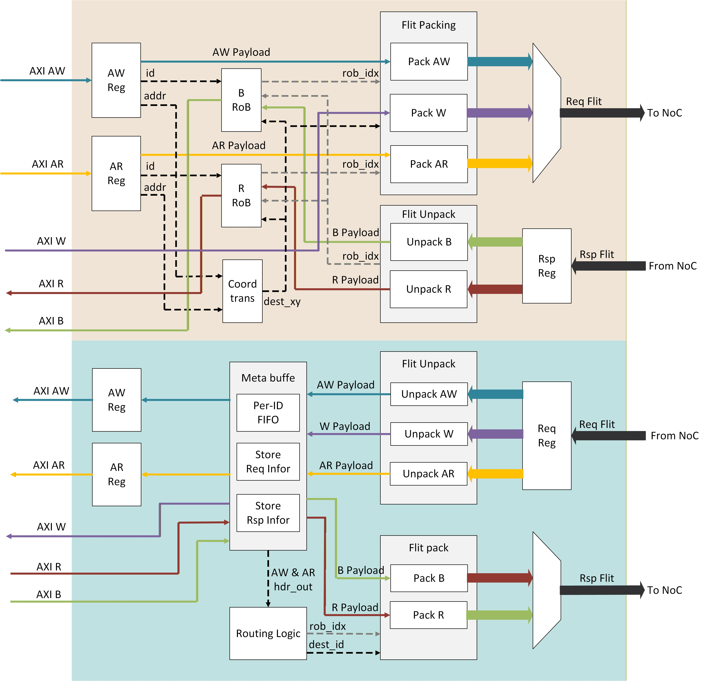

# Network Interface (NI) 規格

處理 AXI 到 NoC 的 Protocol Conversion，包含地址轉換、Flit Packing/Unpacking、Reorder Buffer、ECC 與 Multicast Response Aggregation。所有參數與 [Flit Format](04_flit.md) 一致，採全固定參數設計。

---

## 1. Design Parameters

所有參數鎖定為固定值，與 [Flit Format](04_flit.md) Section 1.2 完全一致：

| Parameter | Value | Description |
|-----------|-------|-------------|
| `AXI_ADDR_WIDTH` | 64 | AXI address width |
| `AXI_ID_WIDTH` | 8 | AXI transaction ID width |
| `AXI_DATA_WIDTH` | 256 | AXI data width (32 bytes) |
| `AXI_USER_WIDTH` | 8 | AXI user signal width |
| `X_WIDTH` | 4 | X coordinate width (max 16 columns) |
| `Y_WIDTH` | 4 | Y coordinate width (max 16 rows) |
| `NODE_ID_WIDTH` | 8 | src_id / dst_id width (X_WIDTH + Y_WIDTH) |
| `PORT_ID_WIDTH` | 2 | Port ID width (4 ports per router) |
| `ROB_IDX_WIDTH` | 5 | RoB index width (32 entries) |
| `QOS_WIDTH` | 4 | QoS priority width |
| `ECC_WIDTH` | 32 | Total ECC width (4 x 64-bit granules, 8-bit SECDED each) |
| `HEADER_WIDTH` | 56 | Header width |
| `PAYLOAD_WIDTH` | 352 | Maximum payload width |
| `FLIT_WIDTH` | 408 | Total flit width (Header + Payload) |
| `LOCAL_ADDR_WIDTH` | 32 | NoC local address width |
| `ROB_ENTRIES` | 32 | Reorder Buffer entries per NI |
| `MAX_OUTSTANDING` | 32 | Maximum outstanding transactions (= ROB_ENTRIES) |

---

## 2. Architecture Overview

NI 包含 **NMU**（Network Master Unit）與 **NSU**（Network Slave Unit）兩個獨立模組，分別處理不同方向的資料流。

> **命名慣例（AMD Versal 風格）：** 以 **網路側角色** 命名，非 AXI 側角色。
>
> | 名稱 | AXI 側角色 | 網路側角色 |
> |------|-----------|-----------|
> | **NMU** (Network Master Unit) | AXI Slave port（接收 Master 請求） | 發起 NoC transaction |
> | **NSU** (Network Slave Unit) | AXI Master port（驅動 Slave 介面） | 完成 NoC transaction |



```
                    ┌───────────────────────────────────────────────────┐
                    │                Network Interface                   │
                    │                                                   │
  AXI Master ─────►│  ┌─────────────────────────────────────────────┐  │
  (AW/AR/W)        │  │              NMU                             │  │
                    │  │  ┌──────────┐  ┌──────────┐  ┌──────────┐  │  │──► Req Router
  AXI Master ◄─────│  │  │ Coord    │  │ Flit     │  │ B/R RoB  │  │  │
  (B/R)            │  │  │ Trans    │  │ Packer   │  │          │  │  │◄── Rsp Router
                    │  │  └──────────┘  └──────────┘  └──────────┘  │  │
                    │  │  ┌──────────┐  ┌──────────┐  ┌──────────┐  │  │
                    │  │  │ QoS Gen  │  │ ECC Gen  │  │ Flit     │  │  │
                    │  │  │          │  │          │  │ Unpacker │  │  │
                    │  │  └──────────┘  └──────────┘  └──────────┘  │  │
                    │  └─────────────────────────────────────────────┘  │
                    │                                                   │
  AXI Slave  ◄─────│  ┌─────────────────────────────────────────────┐  │
  (AW/AR/W)        │  │              NSU                             │  │◄── Req Router
                    │  │  ┌──────────┐  ┌──────────┐  ┌──────────┐  │  │
  AXI Slave  ─────►│  │  │ Flit     │  │ Req Info │  │ Flit     │  │  │──► Rsp Router
  (B/R)            │  │  │ Unpacker │  │ Store    │  │ Packer   │  │  │
                    │  │  └──────────┘  └──────────┘  └──────────┘  │  │
                    │  │  ┌──────────┐  ┌──────────┐                │  │
                    │  │  │ ECC Chk  │  │ MC Resp  │                │  │
                    │  │  │          │  │ Aggreg   │                │  │
                    │  │  └──────────┘  └──────────┘                │  │
                    │  └─────────────────────────────────────────────┘  │
                    └───────────────────────────────────────────────────┘
```

### 2.1 NMU (Network Master Unit)

- **AXI Interface**: AXI Slave（接收本地 AXI Master 請求）
- **功能**:
  - Flit Packing: AXI AW/AR/W → Req Flit → **Request Router**
  - Flit Unpacking: **Response Router** → Rsp Flit → AXI B/R
- **關鍵元件**:
  - `Coord Trans`: 地址轉換（addr → dst_id），產生 `rob_idx`
  - `QoS Generator`: 產生/調整 header `qos` 值（詳見 [QoS Design](10_qos.md)）
  - `ECC Generator`: 計算 SECDED ECC，填入 `wecc`/`recc`
  - `Flit Packer (AW/AR/W)`: 將 AXI 信號映射至 408-bit flit
  - `Flit Unpacker (B/R)`: 拆解 Response flit 為 AXI B/R
  - `B RoB / R RoB`: Reorder Buffer，追蹤未完成交易
  - Multicast B response 由 Response Router in-network reduction 合併（見 Section 9）

### 2.2 NSU (Network Slave Unit)

- **AXI Interface**: AXI Master（發送請求至本地 AXI Slave Memory）
- **功能**:
  - Flit Unpacking: **Request Router** → Req Flit → AXI AW/AR/W
  - Flit Packing: AXI B/R → Rsp Flit → **Response Router**
- **關鍵元件**:
  - `Flit Unpacker (AW/AR/W)`: 拆解 Request flit 為 AXI AW/AR/W
  - `Req Info Store`: 暫存 request header 資訊（rob_idx, src_id, qos）供 response 配對
  - `ECC Checker`: 驗證 SECDED ECC，偵測/校正錯誤
  - `Flit Packer (B/R)`: 將 AXI B/R 與 header 資訊組裝為 Response flit
  - `ECC Generator`: 為 R channel rdata 產生 ECC

---

## 3. Address Translation

AXI 使用 64-bit 地址，NoC 使用 32-bit Local Address 加節點座標。

```
  AXI Address (64-bit)
  ┌────────────────────────────────────────────────────────────┐
  │ [63:40] Reserved │ [39:32] Node ID │ [31:0] Local Address │
  └────────────────────────────────────────────────────────────┘
                              │                    │
                              ▼                    ▼
                    ┌─────────────────┐    ┌─────────────┐
                    │  Address Map    │    │ 32-bit Addr │
                    │  Node ID → (x,y)│    │  Pass-thru  │
                    └────────┬────────┘    └──────┬──────┘
                             │                    │
                             ▼                    ▼
                    dst_id {y[3:0], x[3:0]}  local_addr (32-bit)
```

### 3.1 Address Format

| Bits | Field | Description |
|------|-------|-------------|
| [63:40] | Reserved | 必須為 0 |
| [39:32] | Node ID | 8-bit 節點識別碼 (0-255) |
| [31:0] | Local Address | 32-bit 節點內部地址 |

### 3.2 Node ID Encoding

採用 `{y[3:0], x[3:0]}` 座標編碼（與 [Flit Format](04_flit.md) Section 2.2.3 一致）：

```cpp
// Node ID → coordinate conversion
uint8_t node_id = (axi_addr >> 32) & 0xFF;
uint8_t dst_x = node_id & 0x0F;        // bits [3:0]
uint8_t dst_y = (node_id >> 4) & 0x0F; // bits [7:4]
uint8_t dst_id = node_id;              // {y, x} encoding

uint32_t local_addr = axi_addr & 0xFFFFFFFF;
```

### 3.3 NI Address Modes

NI 支援兩種地址模式，依據連接的 AXI Master 類型決定：

| Mode | AXI Master | Address Width | dst_id 來源 |
|------|------------|---------------|-------------|
| **64b Mode** | Host CPU/DMA | 64-bit | 從 addr[39:32] 經 Address Map 轉換 |
| **32b Mode** | Node CPU/DMA | 32-bit | 從 `awuser`/`aruser` 直接讀取 |

#### 64b Mode

AXI Master 使用 64-bit 地址時，NI 透過 System Address Map 轉換：

```cpp
// 64b Mode: extract dst_id from address
uint8_t dst_id = (axi_addr >> 32) & 0xFF;
uint32_t local_addr = axi_addr & 0xFFFFFFFF;
```

`awuser`/`aruser` 在 64b Mode 下保留作為 AXI user signal pass-through，填入 flit payload 的 `awuser`/`aruser` 欄位。

#### 32b Mode

Node 內部 AXI Master 使用 32-bit 地址，dst 座標經由 AXI user 信號傳遞：

```cpp
// 32b Mode: extract dst_id from user signal
uint8_t dst_id = awuser & 0xFF;  // user[7:0] = {dst_y[3:0], dst_x[3:0]}
uint32_t local_addr = axi_addr;  // 32-bit pass-through
```

#### Mode 選擇

Address mode 為 NI 配置參數，取決於連接的 AXI Master 使用的地址寬度。

> **V1 限制**: Compute Node 無 CPU/DMA，32b Mode 未啟用。

---

## 4. Flit Packing（AXI → Flit）

NMU 負責 Request flit packing，NSU 負責 Response flit packing。所有 flit 寬度統一為 408 bits（Header 56 + Payload 352）。

### 4.1 Header Packing（56 bits）

Header bit layout 與 [Flit Format](04_flit.md) Section 2.1 完全一致：

```cpp
struct FlitHeader {
    // Pack into 56-bit header (LSB-first)
    uint64_t pack() const {
        uint64_t hdr = 0;
        hdr |= (uint64_t)(qos       & 0xF)    <<  0;  // [3:0]
        hdr |= (uint64_t)(axi_ch    & 0x7)    <<  4;  // [6:4]
        hdr |= (uint64_t)(src_id    & 0xFF)   <<  7;  // [14:7]
        hdr |= (uint64_t)(dst_id    & 0xFF)   << 15;  // [22:15]
        hdr |= (uint64_t)(port_id   & 0x3)    << 23;  // [24:23]
        hdr |= (uint64_t)(last      & 0x1)    << 25;  // [25]
        hdr |= (uint64_t)(rob_req   & 0x1)    << 26;  // [26]
        hdr |= (uint64_t)(rob_idx   & 0x1F)   << 27;  // [31:27]
        hdr |= (uint64_t)(commtype  & 0x3)    << 32;  // [33:32]
        hdr |= (uint64_t)(mc_mask   & 0xFFFF) << 34;  // [49:34]
        hdr |= (uint64_t)(vc_id     & 0x7)    << 50;  // [52:50] (Ver.B)
        hdr |= (uint64_t)(rsvd      & 0x7)    << 53;  // [55:53]
        return hdr;
    }
};
```

**AXI Channel Type (axi_ch) encoding:**

| axi_ch | Name | Channel |
|--------|------|---------|
| 0 | AW | Write Address (REQ) |
| 1 | W | Write Data (REQ) |
| 2 | AR | Read Address (REQ) |
| 3 | B | Write Response (RSP) |
| 4 | R | Read Response (RSP) |

**Header 欄位來源（NMU, Request Path）：**

| Field | Source |
|-------|--------|
| qos | QoS Generator 輸出（Bypass/Fixed/Limiter/Regulator，詳見 [QoS Design](10_qos.md)） |
| axi_ch | 依 AXI channel 類型設定（0=AW, 1=W, 2=AR） |
| src_id | 本地 NI 座標 `{local_y, local_x}` |
| dst_id | Address Translation 結果 |
| port_id | 目標 local port index（Address Map 提供） |
| last | Single-flit packet（AW, AR）恆為 1；W channel 僅 wlast=1 時設 1 |
| rob_req | 啟用 RoB reorder 時設 1 |
| rob_idx | RoB 分配的 entry index |
| commtype | 0=Unicast, 1=Multicast |
| mc_mask | Multicast bounding box mask（Unicast 時為 0） |

### 4.2 AW Channel Payload Packing（108 bits used, 244 bits padding）

```cpp
// AW Payload: 108 bits → zero-padded to 352 bits
void pack_aw_payload(uint8_t payload[44], const AXI_AW& aw) {
    // Bit [7:0]     awid       8b
    // Bit [71:8]    awaddr     64b
    // Bit [79:72]   awlen      8b
    // Bit [82:80]   awsize     3b
    // Bit [84:83]   awburst    2b
    // Bit [88:85]   awcache    4b
    // Bit [89]      awlock     1b
    // Bit [92:90]   awprot     3b
    // Bit [96:93]   awregion   4b
    // Bit [104:97]  awuser     8b
    // Bit [107:105] aw_rsvd    3b (set to 0)
    // Bit [351:108] padding    244b (set to 0)

    memset(payload, 0, 44);  // 352 bits = 44 bytes

    set_bits(payload, 0,   8,  aw.awid);
    set_bits(payload, 8,   64, aw.awaddr);
    set_bits(payload, 72,  8,  aw.awlen);
    set_bits(payload, 80,  3,  aw.awsize);
    set_bits(payload, 83,  2,  aw.awburst);
    set_bits(payload, 85,  4,  aw.awcache);
    set_bits(payload, 89,  1,  aw.awlock);
    set_bits(payload, 90,  3,  aw.awprot);
    set_bits(payload, 93,  4,  aw.awregion);
    set_bits(payload, 97,  8,  aw.awuser);
    // bits [107:105] = 0 (reserved)
    // bits [351:108] = 0 (padding)
}
```

### 4.3 AR Channel Payload Packing（108 bits used, 244 bits padding）

結構與 AW 完全相同，欄位名稱 `aw` → `ar`：

```cpp
void pack_ar_payload(uint8_t payload[44], const AXI_AR& ar) {
    memset(payload, 0, 44);
    set_bits(payload, 0,   8,  ar.arid);
    set_bits(payload, 8,   64, ar.araddr);
    set_bits(payload, 72,  8,  ar.arlen);
    set_bits(payload, 80,  3,  ar.arsize);
    set_bits(payload, 83,  2,  ar.arburst);
    set_bits(payload, 85,  4,  ar.arcache);
    set_bits(payload, 89,  1,  ar.arlock);
    set_bits(payload, 90,  3,  ar.arprot);
    set_bits(payload, 93,  4,  ar.arregion);
    set_bits(payload, 97,  8,  ar.aruser);
}
```

### 4.4 W Channel Payload Packing（352 bits, no padding）

```cpp
// W Payload: 352 bits (fills entire payload)
void pack_w_payload(uint8_t payload[44], const AXI_W& w, const uint8_t ecc[4]) {
    // Bit [0]       wlast     1b
    // Bit [8:1]     wuser     8b
    // Bit [264:9]   wdata     256b (32 bytes, little-endian)
    // Bit [296:265] wstrb     32b  (per-byte enable)
    // Bit [328:297] wecc      32b  (4 x 8-bit SECDED)
    // Bit [351:329] w_rsvd    23b  (set to 0)

    memset(payload, 0, 44);

    set_bits(payload, 0,   1,   w.wlast);
    set_bits(payload, 1,   8,   w.wuser);
    set_bits(payload, 9,   256, w.wdata);   // 32 bytes, little-endian
    set_bits(payload, 265, 32,  w.wstrb);
    set_bits(payload, 297, 32,  pack_ecc(ecc));  // ECC generated by NI
    // bits [351:329] = 0 (reserved)
}
```

### 4.5 B Channel Payload Packing（64 bits used, 288 bits padding）

NSU 產生 B response flit：

```cpp
// B Payload: 64 bits → zero-padded to 352 bits
void pack_b_payload(uint8_t payload[44], const AXI_B& b,
                    bool ecc_fail, uint8_t mc_status) {
    // Bit [7:0]    bid              8b
    // Bit [9:8]    bresp            2b
    // Bit [17:10]  buser            8b
    // Bit [18]     ecc_fail         1b  (NoC internal)
    // Bit [20:19]  multicast_status 2b  (NoC internal)
    // Bit [63:21]  b_rsvd           43b (set to 0)
    // Bit [351:64] padding          288b (set to 0)

    memset(payload, 0, 44);

    set_bits(payload, 0,  8,  b.bid);
    set_bits(payload, 8,  2,  b.bresp);
    set_bits(payload, 10, 8,  b.buser);
    set_bits(payload, 18, 1,  ecc_fail ? 1 : 0);
    set_bits(payload, 19, 2,  mc_status);
}
```

**multicast_status encoding（與 [Flit Format](04_flit.md) Section 3.3 一致）：**

| Value | Name | Description |
|-------|------|-------------|
| 0 | UNICAST | Non-multicast transaction |
| 1 | MC_ALL_OK | All destinations succeeded |
| 2 | MC_PARTIAL | Partial failure |
| 3 | MC_ALL_FAIL | All destinations failed |

### 4.6 R Channel Payload Packing（352 bits, no padding）

NSU 產生 R response flit：

```cpp
// R Payload: 352 bits (fills entire payload)
void pack_r_payload(uint8_t payload[44], const AXI_R& r, const uint8_t ecc[4]) {
    // Bit [0]       rlast     1b
    // Bit [8:1]     rid       8b
    // Bit [10:9]    rresp     2b
    // Bit [18:11]   ruser     8b
    // Bit [274:19]  rdata     256b (32 bytes, little-endian)
    // Bit [306:275] recc      32b  (4 x 8-bit SECDED)
    // Bit [351:307] r_rsvd    45b  (set to 0)

    memset(payload, 0, 44);

    set_bits(payload, 0,   1,   r.rlast);
    set_bits(payload, 1,   8,   r.rid);
    set_bits(payload, 9,   2,   r.rresp);
    set_bits(payload, 11,  8,   r.ruser);
    set_bits(payload, 19,  256, r.rdata);   // 32 bytes, little-endian
    set_bits(payload, 275, 32,  pack_ecc(ecc));  // ECC generated by NI
}
```

### 4.7 Payload Utilization Summary

| Channel | Network | Actual Payload | Padding | Flit Total |
|---------|---------|---------------|---------|------------|
| AW | REQ | 108 | 244 | 408 |
| W | REQ | 352 | 0 | 408 |
| AR | REQ | 108 | 244 | 408 |
| B | RSP | 64 | 288 | 408 |
| R | RSP | 352 | 0 | 408 |

### 4.8 NMU Injection Rate & Buffering

NMU 將 AXI transaction 轉換為 flit 後，經由 injection buffer 控制注入 mesh 的速率。

#### Injection Buffer

NMU 內部有 injection buffer，暫存已打包但尚未注入 mesh 的 flit：

| Parameter | Value | Description |
|-----------|-------|-------------|
| `NMU_BUFFER_DEPTH` | 2 | NMU injection buffer 深度（per channel: req/rsp 各一組） |
| Max injection rate | 1 flit/cycle | 每個 NMU port 每 cycle 最多注入 1 flit |

#### 注入流程

```
AXI Master → [Flit Packer] → [Injection Buffer] → Router LOCAL port
                              (depth=NMU_BUFFER_DEPTH)
                                     ↑
                              Credit 控制：有 credit → pop 注入
                              Buffer 滿 → AXI backpressure
```

1. **Flit Packing**：AXI AW/W/AR transaction 經 Flit Packer 打包為 408-bit flit
2. **Buffer Push**：打包完成的 flit 推入 injection buffer（FIFO）
3. **Credit Check**：每 cycle 檢查對應 Router LOCAL port 的 credit（Version B）或 `out_ready`（Version A）
4. **Injection**：有 credit/ready 時，從 injection buffer pop head flit，設定 `out_valid` / `out_flit` 注入 Router
5. **Rate Limit**：每 cycle 每個方向（req/rsp）最多注入 1 flit

#### AXI Backpressure

當 injection buffer 滿時，NMU 對 AXI Master 產生 backpressure：

```cpp
// NMU AXI ready 信號
bool axi_awready() const {
    return injection_buffer_req.size() < NMU_BUFFER_DEPTH
           && can_accept_request();  // RoB has free entry
}

bool axi_wready() const {
    return injection_buffer_req.size() < NMU_BUFFER_DEPTH;
}

bool axi_arready() const {
    return injection_buffer_req.size() < NMU_BUFFER_DEPTH
           && can_accept_request();  // RoB has free entry
}
```

Backpressure 觸發條件（任一成立即 deassert ready）：

| Condition | Effect |
|-----------|--------|
| Injection buffer 滿 | `awready=0` / `wready=0` / `arready=0` |
| RoB 無 free entry | `awready=0` / `arready=0`（W channel 不受 RoB 限制） |
| Downstream Router credit = 0 | Injection buffer 無法 drain，間接 backpressure |

#### C++ Implementation

```cpp
struct NMU {
    FlitBuffer injection_buffer_req;  // depth = NMU_BUFFER_DEPTH (for AW/W/AR)
    FlitBuffer injection_buffer_rsp;  // depth = NMU_BUFFER_DEPTH (for B/R unpacked output, if needed)

    static constexpr int NMU_BUFFER_DEPTH = 2;

    // Called in Phase 8 (NI Processing)
    void process_injection(NIPort& req_out_port) {
        // Try to inject one flit per cycle
        if (!injection_buffer_req.empty() && req_out_port.can_send()) {
            Flit flit = injection_buffer_req.pop();
            req_out_port.out_valid = true;
            req_out_port.out_flit  = flit;
        }
    }
};
```

---

## 5. Flit Unpacking（Flit → AXI）

### 5.1 Header Unpacking

```cpp
void unpack_header(uint64_t hdr, FlitHeader& h) {
    h.qos       = (hdr >>  0) & 0xF;
    h.axi_ch    = (hdr >>  4) & 0x7;
    h.src_id    = (hdr >>  7) & 0xFF;
    h.dst_id    = (hdr >> 15) & 0xFF;
    h.port_id   = (hdr >> 23) & 0x3;
    h.last      = (hdr >> 25) & 0x1;
    h.rob_req   = (hdr >> 26) & 0x1;
    h.rob_idx   = (hdr >> 27) & 0x1F;
    h.commtype  = (hdr >> 32) & 0x3;
    h.mc_mask   = (hdr >> 34) & 0xFFFF;
    h.vc_id     = (hdr >> 50) & 0x7;
}
```

### 5.2 AW/AR Payload Unpacking（NSU, Request Path）

```cpp
void unpack_aw_payload(const uint8_t payload[44], AXI_AW& aw) {
    aw.awid     = get_bits(payload, 0,   8);
    aw.awaddr   = get_bits(payload, 8,   64);  // local_addr (32-bit portion)
    aw.awlen    = get_bits(payload, 72,  8);
    aw.awsize   = get_bits(payload, 80,  3);
    aw.awburst  = get_bits(payload, 83,  2);
    aw.awcache  = get_bits(payload, 85,  4);
    aw.awlock   = get_bits(payload, 89,  1);
    aw.awprot   = get_bits(payload, 90,  3);
    aw.awregion = get_bits(payload, 93,  4);
    aw.awuser   = get_bits(payload, 97,  8);
}
```

### 5.3 W Payload Unpacking（NSU, Request Path）

```cpp
void unpack_w_payload(const uint8_t payload[44], AXI_W& w, uint32_t& wecc) {
    w.wlast = get_bits(payload, 0,   1);
    w.wuser = get_bits(payload, 1,   8);
    get_data(payload, 9,   256, w.wdata);   // 32 bytes
    w.wstrb = get_bits(payload, 265, 32);
    wecc    = get_bits(payload, 297, 32);
}
```

### 5.4 B Payload Unpacking（NMU, Response Path）

```cpp
void unpack_b_payload(const uint8_t payload[44], AXI_B& b,
                      bool& ecc_fail, uint8_t& mc_status) {
    b.bid      = get_bits(payload, 0,  8);
    b.bresp    = get_bits(payload, 8,  2);
    b.buser    = get_bits(payload, 10, 8);
    ecc_fail   = get_bits(payload, 18, 1);
    mc_status  = get_bits(payload, 19, 2);
}
```

### 5.5 R Payload Unpacking（NMU, Response Path）

```cpp
void unpack_r_payload(const uint8_t payload[44], AXI_R& r, uint32_t& recc) {
    r.rlast = get_bits(payload, 0,   1);
    r.rid   = get_bits(payload, 1,   8);
    r.rresp = get_bits(payload, 9,   2);
    r.ruser = get_bits(payload, 11,  8);
    get_data(payload, 19,  256, r.rdata);   // 32 bytes
    recc    = get_bits(payload, 275, 32);
}
```

### 5.6 NSU W-Flit Reassembly（Request Path）

NSU 收到多個 W flit 後，需重組為完整的 AXI W burst transaction，再發起 AXI Write 至 local memory。

#### Reassembly 流程

```
Router LOCAL → NSU
                ↓
  1. 收到 AW flit → 解碼 awlen, 記錄 expected beat count
  2. 收到 W HEAD flit → 開始 reassembly, 寫入 reassembly buffer[0]
  3. 收到 W BODY flit → 寫入 reassembly buffer[1..N-2]
  4. 收到 W TAIL flit (last=1) → 寫入 reassembly buffer[N-1]
  5. Reassembly 完成 → 發起 AXI AW + W burst 至 local memory
```

#### Reassembly Buffer

| Parameter | Value | Description |
|-----------|-------|-------------|
| `NSU_REASSEMBLY_DEPTH` | 16 | 最大可暫存的 W flit 數（= max burst length） |

NSU 為每個 in-flight write transaction 維護一個 reassembly context：

```cpp
struct WriteReassemblyContext {
    enum State { IDLE, WAIT_W, COMPLETE };

    State    state = IDLE;
    AXI_AW   aw;                    // 已解碼的 AW 信息
    uint8_t  expected_beats;         // awlen + 1
    uint8_t  received_beats;         // 已收到的 W flit 數
    Flit     w_flits[16];            // Reassembly buffer (max 16 beats)
    ReqInfo  req_info;               // 暫存的 header info (rob_idx, src_id, qos)
};
```

#### State Machine

```
         ┌────────┐
         │  IDLE  │
         └───┬────┘
             │ 收到 AW flit
             │ → 解碼 awlen, 記錄 req_info
             │ → expected_beats = awlen + 1
             ▼
         ┌────────┐
         │WAIT_W  │◄──┐
         └───┬────┘   │ 收到 W flit (last=0)
             │        │ → received_beats++
             │────────┘
             │ 收到 W flit (last=1)
             │ → received_beats++
             │ → assert(received_beats == expected_beats)
             ▼
         ┌──────────┐
         │ COMPLETE │
         └───┬──────┘
             │ 發起 AXI AW + W burst
             │ → 清除 context → 回到 IDLE
             ▼
         ┌────────┐
         │  IDLE  │
         └────────┘
```

#### 關鍵規則

1. **AW 先於 W 到達**：NMU 保證 AW flit 先注入，XY routing 保證 AW 與 W 走相同路徑，FIFO 順序保證 AW 先到達 NSU
2. **W flit 連續到達**：W burst 為 wormhole packet，一旦 HEAD flit 鎖定路徑，後續 BODY/TAIL flit 連續到達（除非 stall）
3. **Beat 數驗證**：reassembly 完成時檢查 `received_beats == expected_beats`，不匹配為 protocol error
4. **ECC 逐 flit 檢查**：每個 W flit 到達時立即進行 ECC check，不等 reassembly 完成
5. **Backpressure**：若 reassembly buffer 滿或 local memory AXI Slave 未就緒，NSU 透過 `out_ready=0` 向 Router LOCAL port 產生 backpressure

---

## 6. AXI Burst Handling

NI 需處理 AXI Burst transaction，將單一 AXI 交易轉換為一個或多個 flit。

### 6.1 Burst Types

| awburst/arburst | Name | Description |
|-----------------|------|-------------|
| 0 | FIXED | 所有 beat 使用相同地址 |
| 1 | INCR | 地址遞增 |
| 2 | WRAP | 地址 wrap-around |
| 3 | Reserved | — |

### 6.2 Flit 生成規則

#### Write Transaction（AW + W → Flit sequence）

一筆 AXI Write 產生 `1 + (awlen + 1)` 個 flit：

```
AXI AW (awlen=N) + W[0..N] → AW_Flit + W_Flit[0] + W_Flit[1] + ... + W_Flit[N]
```

```cpp
// Write transaction → flit sequence
void generate_write_flits(const AXI_AW& aw, const AXI_W w[],
                          std::vector<Flit>& flits) {
    FlitHeader base_hdr = {};
    base_hdr.qos     = qos_generator.calculate(aw);
    base_hdr.src_id  = local_node_id;
    base_hdr.dst_id  = address_translate(aw.awaddr);
    base_hdr.port_id = address_map_port(aw.awaddr);
    base_hdr.rob_req = 1;
    base_hdr.rob_idx = rob_allocate(aw.awid);
    base_hdr.commtype = is_multicast(aw) ? 1 : 0;
    base_hdr.mc_mask  = is_multicast(aw) ? calc_mc_mask(aw) : 0;

    // AW flit: single-flit packet, last=1
    Flit aw_flit;
    base_hdr.axi_ch = 0;  // AW
    base_hdr.last   = 1;  // AW is always single-flit
    aw_flit.header = base_hdr.pack();
    pack_aw_payload(aw_flit.payload, aw);
    flits.push_back(aw_flit);

    // W flits: multi-flit packet
    uint8_t num_beats = aw.awlen + 1;
    for (uint8_t i = 0; i < num_beats; i++) {
        Flit w_flit;
        base_hdr.axi_ch = 1;  // W
        base_hdr.last   = (i == num_beats - 1) ? 1 : 0;  // last on final beat
        w_flit.header = base_hdr.pack();

        // Generate ECC for wdata
        uint8_t ecc[4];
        ecc_generate(w[i].wdata, 256, ecc);
        pack_w_payload(w_flit.payload, w[i], ecc);
        flits.push_back(w_flit);
    }
}
```

#### Read Transaction（AR → single flit）

一筆 AXI Read 產生 1 個 flit：

```
AXI AR → AR_Flit (single-flit, last=1)
```

```cpp
void generate_read_flit(const AXI_AR& ar, Flit& flit) {
    FlitHeader hdr = {};
    hdr.axi_ch  = 2;  // AR
    hdr.qos     = qos_generator.calculate(ar);
    hdr.src_id  = local_node_id;
    hdr.dst_id  = address_translate(ar.araddr);
    hdr.port_id = address_map_port(ar.araddr);
    hdr.last    = 1;  // AR is always single-flit
    hdr.rob_req = 1;
    hdr.rob_idx = rob_allocate(ar.arid);

    flit.header = hdr.pack();
    pack_ar_payload(flit.payload, ar);
}
```

#### Read Response（R → multi-flit）

NSU 收到 AXI R 後產生 `arlen + 1` 個 R flit：

```
AXI R[0..N] → R_Flit[0] + R_Flit[1] + ... + R_Flit[N]
```

```cpp
void generate_r_response_flit(const AXI_R& r, const ReqInfo& info, Flit& flit) {
    FlitHeader hdr = {};
    hdr.axi_ch  = 4;         // R
    hdr.qos     = info.qos;  // 繼承 request 的 qos
    hdr.src_id  = local_node_id;
    hdr.dst_id  = info.src_id;   // 回程: dst = 原始 requester
    hdr.port_id = info.port_id;
    hdr.last    = r.rlast ? 1 : 0;
    hdr.rob_req = info.rob_req;
    hdr.rob_idx = info.rob_idx;

    // Generate ECC for rdata
    uint8_t ecc[4];
    ecc_generate(r.rdata, 256, ecc);

    flit.header = hdr.pack();
    pack_r_payload(flit.payload, r, ecc);
}
```

### 6.3 Burst Address Calculation（NSU Unpacking）

NSU 將 AW/AR flit 解碼後，需依 burst type 計算每個 beat 的地址。地址資訊完整保留在 AW/AR payload 中，NSU 使用標準 AXI burst 規則：

```cpp
// Calculate address for each beat in a burst
uint64_t calc_burst_addr(uint64_t start_addr, uint8_t burst_type,
                         uint8_t size, uint8_t len, uint8_t beat_idx) {
    uint32_t byte_count = 1 << size;      // bytes per beat
    uint64_t aligned = start_addr & ~(uint64_t)(byte_count - 1);

    switch (burst_type) {
    case 0:  // FIXED: same address for all beats
        return start_addr;

    case 1:  // INCR: incrementing address
        return aligned + (uint64_t)beat_idx * byte_count;

    case 2: {  // WRAP: wrapping address
        uint32_t wrap_boundary = byte_count * (len + 1);
        uint64_t addr = aligned + (uint64_t)beat_idx * byte_count;
        uint64_t lower = start_addr & ~(uint64_t)(wrap_boundary - 1);
        if (addr >= lower + wrap_boundary)
            addr -= wrap_boundary;
        return addr;
    }
    default:
        return start_addr;
    }
}
```

### 6.4 Burst → Flit 數量關係

| Transaction | awlen/arlen | Flit Count | last=1 位置 |
|-------------|-------------|------------|-------------|
| Single Write | 0 | 1 AW + 1 W = 2 | AW flit, W flit |
| Burst Write (N beats) | N-1 | 1 AW + N W = N+1 | AW flit, W[N-1] flit |
| Single Read Request | 0 | 1 AR | AR flit |
| Burst Read Request | N-1 | 1 AR | AR flit |
| Single Read Response | — | 1 R | R flit |
| Burst Read Response (N beats) | — | N R | R[N-1] flit |
| Write Response | — | 1 B | B flit |

> **Note**: AXI4 規範移除了 WID，因此 W flit 透過 AW flit 的順序隱含關聯。Header 中的 `axi_ch=1`（W）不含 transaction ID，W beat 按照 AW 發送順序依序對應。

---

## 7. Reorder Buffer (RoB)

每個 NI 的 NMU 側擁有獨立的 32-entry RoB，管理所有 outstanding transactions 的 response reordering。RoB 架構與 [Flit Format](04_flit.md) Section 5 一致。

### 7.1 RoB Entry 結構

```cpp
struct RobEntry {
    enum State { FREE, ALLOCATED, RESPONSE_RECEIVED, READY_TO_RELEASE };

    State    state;
    uint8_t  axi_id;          // AXI transaction ID (8 bits)
    uint8_t  axi_ch;          // 0=AW(write), 2=AR(read)
    uint16_t expected_beats;  // Expected response beats (1 for B, arlen+1 for R)
    uint16_t received_beats;  // Received response beats
    bool     ecc_fail;        // Any ECC error in this transaction
    uint8_t  mc_status;       // Multicast status (B channel only)
    // Response data storage (for R channel multi-beat)
    std::vector<Flit> response_flits;
};
```

### 7.2 RoB State Machine

```
                    ┌──────────┐
                    │   FREE   │◄───────────────────────────────┐
                    └────┬─────┘                                │
                         │ rob_allocate()                       │
                         │ (AW/AR request 發送時)                │
                         ▼                                      │
                    ┌──────────┐                                │
                    │ALLOCATED │                                │
                    └────┬─────┘                                │
                         │ receive_response()                   │
                         │ (B/R flit 到達)                      │
                         ▼                                      │
                    ┌──────────────────┐                        │
                    │RESPONSE_RECEIVED │ ◄──┐                   │
                    └────┬─────────────┘    │                   │
                         │                  │ more beats        │
                         │                  │ (multi-beat R)    │
                         │ ─────────────────┘                   │
                         │ all beats received                   │
                         ▼                                      │
                    ┌──────────────────┐                        │
                    │READY_TO_RELEASE  │                        │
                    └────┬─────────────┘                        │
                         │ release_in_order()                   │
                         │ (依 per-ID 順序輸出)                  │
                         │                                      │
                         └──────────────────────────────────────┘
```

### 7.3 RoB 操作

#### 7.3.1 分配（Allocate）

NMU 在發送 AW/AR request flit 時分配 RoB entry：

```cpp
// Allocate RoB entry when sending request
int rob_allocate(uint8_t axi_id) {
    // Find free entry
    for (int i = 0; i < ROB_ENTRIES; i++) {
        if (rob[i].state == RobEntry::FREE) {
            rob[i].state = RobEntry::ALLOCATED;
            rob[i].axi_id = axi_id;
            rob[i].received_beats = 0;
            rob[i].ecc_fail = false;
            rob[i].mc_status = 0;  // UNICAST
            rob[i].response_flits.clear();

            // Track allocation order per axi_id
            per_id_order[axi_id].push_back(i);

            return i;  // rob_idx
        }
    }
    return -1;  // No free entry → backpressure AXI Master
}
```

#### 7.3.2 接收 Response

NMU 從 Response Router 收到 B/R flit 後，處理流程如下：

1. **B response**（含 in-network reduction 後的 multicast B）→ 直接送入 RoB
2. **R response** → 直接送入 RoB

Multicast B response 經 in-network reduction 後已合併為 1 個 flit，NMU 不需特殊處理（見 Section 9）。

```cpp
void nmu_receive_response(const Flit& flit) {
    FlitHeader hdr;
    unpack_header(flit.header, hdr);

    if (hdr.axi_ch == 3) {  // B channel
        AXI_B b;
        bool ecc_fail;
        uint8_t mc_status_in;
        unpack_b_payload(flit.payload, b, ecc_fail, mc_status_in);

        // Unicast 與 Multicast（已 in-network reduction）統一處理
        rob_receive_b(hdr.rob_idx, b, ecc_fail, mc_status_in);
    } else if (hdr.axi_ch == 4) {  // R channel
        rob_receive_r(flit, hdr);
    }
}

// B response 寫入 RoB（unicast 或已聚合的 multicast）
void rob_receive_b(uint8_t idx, const AXI_B& b,
                   bool ecc_fail, uint8_t mc_status) {
    assert(rob[idx].state == RobEntry::ALLOCATED);
    rob[idx].ecc_fail = ecc_fail;
    rob[idx].mc_status = mc_status;
    rob[idx].state = RobEntry::READY_TO_RELEASE;
}

// R response 寫入 RoB（multi-beat）
void rob_receive_r(const Flit& flit, const FlitHeader& hdr) {
    uint8_t idx = hdr.rob_idx;
    assert(rob[idx].state == RobEntry::ALLOCATED ||
           rob[idx].state == RobEntry::RESPONSE_RECEIVED);

    rob[idx].response_flits.push_back(flit);
    rob[idx].received_beats++;
    rob[idx].state = RobEntry::RESPONSE_RECEIVED;
    if (hdr.last) {
        rob[idx].state = RobEntry::READY_TO_RELEASE;
    }
    }
}
```

#### 7.3.3 依序釋放（In-Order Release per AXI ID）

相同 `axi_id` 的交易必須依 rob_idx 分配順序依序 release：

```cpp
// Release responses in allocation order per AXI ID
bool rob_try_release(uint8_t axi_id, std::vector<Flit>& out_flits) {
    auto& order = per_id_order[axi_id];
    if (order.empty()) return false;

    int idx = order.front();
    if (rob[idx].state != RobEntry::READY_TO_RELEASE)
        return false;  // Head-of-line not ready, cannot release

    // Release all response flits for this entry
    out_flits = std::move(rob[idx].response_flits);

    // Record ECC/MC errors to CSR
    if (rob[idx].ecc_fail) {
        csr.err_status |= 0x1;
        csr.ecc_err_count = sat_add(csr.ecc_err_count, 1);
    }
    if (rob[idx].mc_status == 2) {  // MC_PARTIAL
        csr.err_status |= 0x4;
        csr.mc_fail_count = sat_add(csr.mc_fail_count, 1);
    } else if (rob[idx].mc_status == 3) {  // MC_ALL_FAIL
        csr.err_status |= 0x8;
        csr.mc_fail_count = sat_add(csr.mc_fail_count, 1);
    }

    // Free entry
    rob[idx].state = RobEntry::FREE;
    order.pop_front();

    return true;
}
```

#### 7.3.4 Backpressure

當 RoB 無 free entry 時，NMU 對 AXI Master 產生 backpressure：

```cpp
bool can_accept_request() const {
    // Check if any free RoB entry available
    for (int i = 0; i < ROB_ENTRIES; i++) {
        if (rob[i].state == RobEntry::FREE)
            return true;
    }
    return false;  // Deassert AXI AWREADY/ARREADY
}
```

### 7.4 rob_idx vs axi_id

兩者獨立，用途不同（與 [Flit Format](04_flit.md) Section 5.1 一致）：

| Field | Location | Scope | Purpose |
|-------|----------|-------|---------|
| axi_id | Payload (8b) | Per-transaction stream | AXI per-ID ordering |
| rob_idx | Header (5b) | Shared across all IDs | RoB entry index |

同一 `axi_id` 的多筆 outstanding transactions 各佔一個 rob_idx。Per-ID ordering 由 `per_id_order` deque 保證 — 同 ID responses 依 rob_idx 分配順序依序 release。

---

## 8. ECC Generate / Check

採用 SECDED（Single Error Correct, Double Error Detect），與 [Flit Format](04_flit.md) Section 3.6 完全一致。

### 8.1 ECC Parameters

| Parameter | Value |
|-----------|-------|
| Data granule | 64 bits |
| ECC per granule | 8 bits (Hsiao SECDED) |
| Granules per 256-bit data | 4 |
| Total ECC width | 32 bits |
| Error correction | 1-bit per granule |
| Error detection | 2-bit per granule |

### 8.2 ECC Generate（Source NI）

Source NI 於 flit 注入時計算 ECC：

```cpp
// Generate SECDED ECC for 256-bit data
// Called by: NMU (W channel) and NSU (R channel)
void ecc_generate(const uint8_t data[32], uint16_t data_width_bits,
                  uint8_t ecc_out[4]) {
    // 4 granules, each 64-bit → 8-bit SECDED
    for (int g = 0; g < 4; g++) {
        uint64_t granule = 0;
        memcpy(&granule, &data[g * 8], 8);  // 64-bit granule
        ecc_out[g] = hsiao_secded_encode(granule);  // 8-bit SECDED
    }
}

// Pack 4 x 8-bit ECC into 32-bit
uint32_t pack_ecc(const uint8_t ecc[4]) {
    return (uint32_t)ecc[0]
         | ((uint32_t)ecc[1] << 8)
         | ((uint32_t)ecc[2] << 16)
         | ((uint32_t)ecc[3] << 24);
}
```

**ECC Generate 時機：**

| NI | Channel | Data Source | ECC Field |
|----|---------|-------------|-----------|
| NMU | W (request) | `wdata[255:0]` → `wecc[31:0]` | payload[328:297] |
| NSU | R (response) | `rdata[255:0]` → `recc[31:0]` | payload[306:275] |

### 8.3 ECC Check（Destination NI）

Destination NI 於 flit 接收時驗證 ECC：

```cpp
// Check SECDED ECC for 256-bit data
// Called by: NSU (W channel) and NMU (R channel)
enum EccResult { ECC_OK, ECC_CORRECTED, ECC_UNCORRECTABLE };

EccResult ecc_check(const uint8_t data[32], const uint8_t ecc_received[4],
                    uint8_t data_corrected[32]) {
    EccResult worst = ECC_OK;
    memcpy(data_corrected, data, 32);

    for (int g = 0; g < 4; g++) {
        uint64_t granule = 0;
        memcpy(&granule, &data[g * 8], 8);

        uint8_t syndrome = hsiao_secded_syndrome(granule, ecc_received[g]);

        if (syndrome == 0) {
            // No error
        } else if (is_single_bit_error(syndrome)) {
            // 1-bit error: correct
            uint64_t corrected = hsiao_secded_correct(granule, syndrome);
            memcpy(&data_corrected[g * 8], &corrected, 8);
            if (worst == ECC_OK) worst = ECC_CORRECTED;
        } else {
            // 2-bit error: uncorrectable
            worst = ECC_UNCORRECTABLE;
        }
    }
    return worst;
}
```

**ECC Check 結果處理：**

| Result | W Channel (NSU) | R Channel (NMU) |
|--------|-----------------------|----------------------|
| ECC_OK | 正常處理 | 正常處理 |
| ECC_CORRECTED | 使用校正後資料，log to CSR | 使用校正後資料，log to CSR |
| ECC_UNCORRECTABLE | B response 設 `ecc_fail=1`，`bresp=SLVERR` | `rresp` 設 SLVERR，log to CSR |

### 8.4 End-to-End Scope

```
Source NI (generate) → Router (pass-through) → ... → Dest NI (check)
```

Router 不檢查、不修改 ECC — 純透通。ECC 保護範圍僅涵蓋 payload data（wdata/rdata），不涵蓋 header 及 payload metadata。

---

## 9. Multicast Response — In-Network Reduction

Multicast 僅適用 Request channel（AW/W）。多個 destination 的 B response 在 **Response Router 中逐 hop 合併**（in-network reduction），Source NMU 僅收到 **1 個** 已合併的 B response。Reduction 的 Router 層實作詳見 [Router Specification](02_router.md) Section 10.3。

### 9.1 端到端流程

```
Forward (Multicast):
  Source NMU → AW/W flit (commtype=Multicast) → Req Router fan-out → Dest NSU₀..ₙ₋₁

Backward (Reduction):
  Dest NSU₀ → B flit (commtype=ParallelReduction) ──┐
  Dest NSU₁ → B flit (commtype=ParallelReduction) ──┤ Rsp Router 逐 hop 合併
  Dest NSU₂ → B flit (commtype=ParallelReduction) ──┤────► 1 merged B → Source NMU
  Dest NSUₙ₋₁ → B flit (commtype=ParallelReduction)┘
```

### 9.2 NSU: commtype 轉換

Dest NSU 收到 Multicast AW 後完成 AXI 寫入，產生 B response flit。**關鍵轉換**：

```cpp
// NSU 產生 B response flit 時
FlitHeader b_hdr;
b_hdr.commtype = CommType::ParallelReduction;  // Multicast → ParallelReduction
b_hdr.src_id   = local_node_id;                // 本 NSU 座標
b_hdr.dst_id   = original_aw_hdr.src_id;       // 回程目的地 = 原始 source
b_hdr.multicast_mask = original_aw_hdr.multicast_mask;  // 複製原始 RCR bounding box
// qos, axi_ch, rob_idx 等從原始 AW 繼承
```

**必須保留的欄位：**

| 欄位 | 來源 | 用途 |
|------|------|------|
| `multicast_mask` | 原始 AW flit 的 mask | Response Router 計算 `in_route_mask` |
| `src_id` (of AW) | 原始 AW flit 的 src_id | Reduction output routing 目標 |
| `rob_idx` | 原始 AW flit | Source NMU 的 RoB 配對 |

NSU 需在 meta buffer 中暫存 multicast AW 的 header 資訊（`multicast_mask`、`src_id`、`rob_idx`），直到 B response 發送完成。

### 9.3 Response Router: Reduction 行為

Response Router 根據 `commtype` 分流：

- `commtype = Unicast (0)` → 標準 wormhole arbiter（unicast response）
- `commtype = ParallelReduction (2)` → ReductionSync + ReductionArbiter

每個 hop 的 Response Router：
1. 用 RCR forward routing 公式計算 `in_route_mask`（= forward `route_sel`）
2. 等待所有 `in_route_mask` 中的 input 方向都有 valid 的 ParallelReduction B flit
3. 合併：任一 `bresp ≠ OKAY` → 最終 `SLVERR`；任一 `ecc_fail` → 最終 `ecc_fail = 1`
4. 以 unicast XY routing 向 `dst_id`（= original source）方向輸出合併後的 B flit

詳細的 ReductionSync、ReductionArbiter 實作見 [Router Specification](02_router.md) Section 10.3。

### 9.4 合併規則

| Condition | bresp | multicast_status | ecc_fail |
|-----------|-------|-----------------|----------|
| 全部 OKAY，無 ECC error | OKAY (0) | MC_ALL_OK (1) | 0 |
| 全部 OKAY，有 ECC error | SLVERR (2) | MC_ALL_OK (1) | 1 |
| 部分非 OKAY | SLVERR (2) | MC_PARTIAL (2) | any |
| 全部非 OKAY | SLVERR (2) | MC_ALL_FAIL (3) | any |

`multicast_status` 由最終到達 Source NMU 的合併 B flit 攜帶。NMU 記錄於 CSR，AXI interface 透過 `bresp` 回報。

> **Note**: `multicast_status` 的精確計算（區分 ALL_OK / PARTIAL / ALL_FAIL）需要在 reduction path 中追蹤 ok/fail 計數。簡化實作可僅區分 OKAY vs SLVERR（binary reduction），`multicast_status` 設為 MC_ALL_OK 或 MC_ALL_FAIL。

### 9.5 Source NMU: 簡化接收

Source NMU 在 in-network reduction 模式下 **不需要** MulticastAggregator 或 timeout 機制。Multicast B response 的接收與 unicast B response 完全相同：

```cpp
// NMU response reception — multicast 與 unicast 統一處理
void receive_b_response(const Flit& flit) {
    auto hdr = decode_header(flit);
    AXI_B b;
    bool ecc_fail;
    uint8_t mc_status;
    unpack_b_payload(flit.payload, b, ecc_fail, mc_status);

    // 不論 commtype，直接送入 RoB
    rob_receive_b(hdr.rob_idx, b, ecc_fail, mc_status);

    // Multicast 時 mc_status 記錄於 CSR（供 debug）
    if (mc_status != 0) {  // Non-unicast
        csr.last_mc_status = mc_status;
        if (mc_status >= 2) csr.mc_error_count++;
    }
}
```

### 9.6 In-Network Reduction 的特性

| 特性 | 說明 |
|------|------|
| **NMU 無 aggregator** | 不需要 MulticastAggregator、dest_count、timeout |
| **Response 流量最小化** | N 個 B flit 在 router 逐步合併為 1 個 |
| **無需 dest_count** | Router 用 RCR mask 隱式計算 expected inputs |
| **無 timeout 風險** | Reduction 在 router 層同步，不存在 partial collection |
| **僅 B channel** | R channel（multi-flit）不支援 reduction，走 unicast path |
| **Router 額外成本** | Response Router 需 ReductionSync + ReductionArbiter |

---

## 10. NI-Router 連接

NI 與 Router 透過 **abstract interface** 連接，使用與 Router-Router **完全相同**的機制。詳見 [Internal Interface](05_internal_interface.md) Section 3（Abstract Interface）和 Section 5（NI-Router 連接）。

### 10.1 連接架構

```
NI_Interface<Mode>                         Router_Interface<Mode>
==================                         =====================

NMU (Request 注入):
  get_output(REQ)  ──── wire_all() ────────► set_input(local_port, REQ)
  set_input(RSP)   ◄──── wire_all() ─────── get_output(local_port, RSP)

NSU (Request 接收):
  set_input(REQ)   ◄──── wire_all() ─────── get_output(local_port, REQ)
  get_output(RSP)  ──── wire_all() ────────► set_input(local_port, RSP)
```

### 10.2 信號交換

Simulation Driver 的 `wire_all()` 統一處理所有連接（包含 NI-Router）：

```cpp
// NI ↔ Router LOCAL port — 與 Router-Router 使用相同 wiring 機制
for (auto& conn : ni_connections) {
    for (auto ch : {Channel::REQ, Channel::RSP}) {
        auto& out_ni = conn.ni->get_output(ch);
        auto& out_r  = conn.router->get_output(conn.local_port, ch);
        conn.router->set_input(conn.local_port, ch, out_ni);  // NI→Router
        conn.ni->set_input(ch, out_r);                        // Router→NI
    }
}
```

### 10.3 NMU / NSU 方向

| 元件 | Channel | 方向 | 說明 |
|------|---------|------|------|
| NMU | REQ | NI → Router | 注入 AW/W/AR flit 至 Req network |
| NMU | RSP | Router → NI | 接收 B/R flit 從 Rsp network |
| NSU | REQ | Router → NI | 接收 AW/W/AR flit 從 Req network |
| NSU | RSP | NI → Router | 注入 B/R flit 至 Rsp network |

---

## 11. Data Path

### 11.1 Request Path（AXI Master → AXI Slave）

```
來源                                                              目的
AXI Master ──► NMU ──► Request Router ──► NSU ──► AXI Slave (Memory)
              (Flit Pack)                      (Flit Unpack)
```

### 11.2 Response Path（AXI Slave → AXI Master）

```
目的                                                              來源
AXI Slave (Memory) ──► NSU ──► Response Router ──► NMU ──► AXI Master
                      (Flit Pack)                        (Flit Unpack)
```

### 11.3 完整 Write 交易流程

```
┌──────────────────────────────────────────────────────────────────────────────┐
│  Host/Node A                        NoC                        Node B       │
│  (AXI Master)                                                  (Memory)     │
│       │                                                            │        │
│   1.  │  AXI AW (awaddr, awlen, awsize, awburst, awid, awqos)     │        │
│       │  AXI W[0..N] (wdata[255:0], wstrb[31:0], wlast)           │        │
│       │                                                            │        │
│   2.  │  NMU:                                                 │        │
│       │    - Address Translation → dst_id                          │        │
│       │    - QoS Generator → qos (4 bits)                          │        │
│       │    - RoB allocate → rob_idx                                │        │
│       │    - Pack AW flit (header + 108b payload)                  │        │
│       │    - ECC generate → wecc (32 bits)                         │        │
│       │    - Pack W flits (header + 352b payload each)             │        │
│       │                                                            │        │
│   3.  │            ┌──────────────────────────────┐                │        │
│       │──AW flit──►│      Request Router Chain     │──AW flit────►│        │
│       │──W flits──►│   (QoS-aware arbitration)     │──W flits───►│        │
│       │            └──────────────────────────────┘                │        │
│       │                                                            │        │
│   4.  │                                              NSU:    │        │
│       │                                  - Unpack AW → AXI AW     │        │
│       │                                  - ECC check wdata         │        │
│       │                                  - Unpack W  → AXI W      │        │
│       │                                  - Store req info          │        │
│       │                                  - Issue AXI AW + W ──────┼──►     │
│       │                                                            │        │
│   5.  │                                                     AXI B ◄┤        │
│       │                                  NSU:                │        │
│       │                                  - Pack B flit (64b)       │        │
│       │                                  - Set ecc_fail if needed  │        │
│       │                                  - qos = stored req qos   │        │
│       │                                                            │        │
│   6.  │            ┌──────────────────────────────┐                │        │
│       │◄─B flit────│     Response Router Chain     │◄──B flit─────│        │
│       │            └──────────────────────────────┘                │        │
│       │                                                            │        │
│   7.  │  NMU:                                                 │        │
│       │    - Unpack B flit                                         │        │
│       │    - RoB receive → rob_idx match                           │        │
│       │    - RoB release (per-ID order)                             │        │
│       │    - Log ecc_fail/mc_status to CSR                         │        │
│       │    - Output AXI B (bid, bresp, buser)                      │        │
│       │                                                            │        │
│   8.  │◄─AXI B──── done                                           │        │
└──────────────────────────────────────────────────────────────────────────────┘
```

---

## 12. NI 配置

### 12.1 部署配置

每個 NI 可配置為包含 NMU（AXI Master 側）、NSU（AXI Slave 側）或兩者兼具：

| 配置 | NMU | NSU | 說明 |
|------|:---:|:---:|------|
| NMU-only | O | X | 僅發起 Request（不接受來自 NoC 的 Request） |
| NSU-only | X | O | 僅接收 Request（不發起 Request） |
| Full | O | O | 雙向支援 |

NI 連接至 Router 的 LOCAL port（由 `port_id` 識別），同一 Router 上的不同 LOCAL port 可連接不同配置的 NI。

---

## 13. QoS Generator Integration

NI 內的 QoS Generator 支援四種模式，詳細設計見 [QoS Design](10_qos.md)。

### 13.1 Mode Summary

| Mode | Description | Header qos 來源 |
|------|-------------|-----------------|
| **Bypass** | 直通 | `awqos` / `arqos` |
| **Fixed** | 固定值 | `CSR.QOS_FIXED_VALUE` |
| **Limiter** | 限制頻寬上限 | 超標 → `LOW_PRIORITY`，否則 `QOS_FIXED_VALUE` |
| **Regulator** | 保證最低頻寬 | `BASE_QOS + urgency_level` |

### 13.2 QoS 計算時機

QoS 在產生 **AW/AR flit** 時計算（不是 W flit）。W flit 的 `qos` 繼承對應 AW flit 的值。Response flit 的 `qos` 繼承對應 request 的值（由 NSU 的 Req Info Store 提供）。

---

## 14. API Definition

```cpp
class NMU {
public:
    // === AXI Slave Interface (接收本地 AXI Master 請求) ===
    bool accept_aw(const AXI_AW& aw);   // Returns false when backpressured
    bool accept_ar(const AXI_AR& ar);
    bool accept_w(const AXI_W& w);

    // === NoC Request Output ===
    bool has_pending_request() const;
    std::optional<Flit> get_req_flit();  // Output to Req Router

    // === NoC Response Input ===
    bool receive_rsp_flit(const Flit& flit);  // Input from Rsp Router

    // === AXI Response Output ===
    std::optional<AXI_B> get_b_response();
    std::optional<AXI_R> get_r_response();

    // === Cycle Processing ===
    void process_cycle(int current_time);

private:
    // Internal components
    AddressTranslator   addr_trans_;
    QoSGenerator        qos_gen_;
    EccGenerator        ecc_gen_;
    RobTable            rob_;           // 32-entry RoB

    // Buffers
    std::deque<AXI_AW>  aw_fifo_;
    std::deque<AXI_W>   w_fifo_;
    std::deque<Flit>    req_out_fifo_;

    // Per-ID ordering
    std::map<uint8_t, std::deque<uint8_t>> per_id_order_;
};


class NSU {
public:
    // === NoC Request Input ===
    bool receive_req_flit(const Flit& flit);  // Input from Req Router

    // === AXI Master Interface (發送請求至本地 Memory) ===
    std::optional<AXI_AW> get_aw_request();
    std::optional<AXI_AR> get_ar_request();
    std::optional<AXI_W>  get_w_data();

    // === AXI Response Input ===
    bool accept_b(const AXI_B& b);
    bool accept_r(const AXI_R& r);

    // === NoC Response Output ===
    bool has_pending_response() const;
    std::optional<Flit> get_rsp_flit();  // Output to Rsp Router

    // === Cycle Processing ===
    void process_cycle(int current_time);

private:
    // Internal components
    EccChecker          ecc_checker_;
    EccGenerator        ecc_gen_;     // For R response ECC

    // Request info store (for response routing)
    struct ReqInfo {
        uint8_t  rob_idx;
        uint8_t  rob_req;
        uint8_t  src_id;
        uint8_t  port_id;
        uint8_t  qos;
        uint8_t  axi_id;
    };
    std::map<uint8_t, std::deque<ReqInfo>> req_info_;  // key = axi_id

    // Buffers
    std::deque<Flit>   rsp_out_fifo_;
};


class NetworkInterface {
public:
    NetworkInterface(uint8_t node_id, uint8_t port_id, bool has_nmu);

    NMU  nmu;    // 連接本地 AXI Master
    NSU nsu;   // 連接本地 AXI Slave (Memory)

    void process_cycle(int current_time) {
        if (has_nmu_)
            nmu.process_cycle(current_time);
        nsu.process_cycle(current_time);
    }

private:
    uint8_t node_id_;     // {y[3:0], x[3:0]}
    uint8_t port_id_;
    bool    has_nmu_;
};
```

---

## 15. CppNI 內部 Function 定義

本 section 定義 `CppNI`（C++ model 的 NI 實作）的內部 function 分解。CppNI 實作 `NI_Interface<Mode>`，內部區分 NMU（Master 側）和 NSU（Slave 側）的 processing function。

### 15.1 CppNI Class Skeleton

```cpp
template<FlowControlMode Mode>
class CppNI : public NI_Interface<Mode> {
public:
    CppNI(uint8_t node_id, uint8_t port_id, const NocConfig& config,
          LocalMemory& local_mem);

    // === NI_Interface 合約 ===
    const PortOutput<Mode>& get_output(Channel ch) const override;
    void set_input(Channel ch, const PortOutput<Mode>& in) override;
    void tick() override;

    // === NMU（Master）side — TrafficManager 調用 ===
    bool inject_flit(const Flit& flit, Channel ch);  // 注入 flit 到 injection buffer
    bool has_completion() const;
    Completion pop_completion();

private:
    // ======= NMU Functions =======
    void _NmuPackAW(const AXIWriteReq& req);     // AXI AW → flit
    void _NmuPackW(const AXIWriteData& data);     // AXI W → flit(s)
    void _NmuPackAR(const AXIReadReq& req);       // AXI AR → flit
    void _NmuUnpackB(const Flit& flit);           // flit → AXI B response
    void _NmuUnpackR(const Flit& flit);           // flit → AXI R response
    void _NmuInject();                            // injection buffer → network

    // ======= NSU Functions =======
    void _NsuUnpackAW(const Flit& flit);          // flit → AXI AW request
    void _NsuUnpackW(const Flit& flit);           // flit → AXI W (reassembly)
    void _NsuUnpackAR(const Flit& flit);          // flit → AXI AR request
    void _NsuPackB(const AXIWriteResp& resp);     // AXI B → flit
    void _NsuPackR(const AXIReadData& data);      // AXI R → flit(s)
    void _NsuExecuteMemOp();                      // Local memory read/write

    // ======= Shared Functions =======
    void _EccGenerate(Flit& flit);                // ECC generate (source NI)
    void _EccCheck(const Flit& flit);             // ECC check (dest NI)
    void _QosGenerate(FlitHeader& hdr);           // QoS value generation

    // ======= tick() 內部實作 =======
    // void tick() {
    //     // NMU processing
    //     _NmuInject();               // injection buffer → get_output(REQ)
    //     // Process incoming RSP flits
    //     for (auto& flit : rsp_input_) {
    //         if (is_b_flit(flit)) _NmuUnpackB(flit);
    //         if (is_r_flit(flit)) _NmuUnpackR(flit);
    //     }
    //
    //     // NSU processing
    //     for (auto& flit : req_input_) {
    //         if (is_aw_flit(flit)) _NsuUnpackAW(flit);
    //         if (is_w_flit(flit))  _NsuUnpackW(flit);
    //         if (is_ar_flit(flit)) _NsuUnpackAR(flit);
    //     }
    //     _NsuExecuteMemOp();         // Execute pending memory operations
    //     // Pack responses → get_output(RSP)
    // }

    // ======= Internal State =======
    // NMU side
    FlitBuffer     injection_buffer_req_;    // NMU → network (REQ channel)
    FlitBuffer     injection_buffer_rsp_;    // (unused for NMU, reserved)
    ReorderBuffer  rob_;                     // NMU response reordering (32 entries)

    // NSU side
    ReassemblyBuffer reassembly_;            // W burst reassembly
    std::deque<Flit> rsp_out_fifo_;          // NSU → network (RSP channel)

    // Shared
    LocalMemory&   local_mem_;
    uint8_t        node_id_;
    uint8_t        port_id_;
    QoSGenerator   qos_gen_;
    EccGenerator   ecc_gen_;
    EccChecker     ecc_checker_;
    NIStats        stats_;
};
```

### 15.2 NMU Functions 說明

#### _NmuPackAW — AXI AW → Flit

將 AXI Write Address channel 轉換為 header-only flit（單一 flit，last=1）：

```cpp
void _NmuPackAW(const AXIWriteReq& req) {
    Flit flit{};
    flit.header.axi_ch   = AXI_CH_AW;   // 0
    flit.header.src_id    = node_id_;
    flit.header.dst_id    = extract_node_id(req.addr);
    flit.header.port_id   = extract_port_id(req.addr);
    flit.header.last      = true;         // AW 恆為 single-flit
    flit.header.rob_req   = true;
    flit.header.rob_idx   = rob_.allocate(req.axi_id, AXI_CH_AW, 1);
    flit.header.commtype  = req.is_multicast ? CommType::Multicast : CommType::Unicast;
    flit.header.multicast_mask = req.mc_mask;
    _QosGenerate(flit.header);

    // Payload: pack AW fields (108 bits used, 244 bits padding)
    pack_aw_payload(flit.payload, req);
    _EccGenerate(flit);

    injection_buffer_req_.push(flit);
}
```

#### _NmuPackW — AXI W → Flit(s)

將 AXI Write Data channel 轉換為 flit burst（awlen+1 flits）：

```cpp
void _NmuPackW(const AXIWriteData& data) {
    for (int beat = 0; beat <= data.awlen; beat++) {
        Flit flit{};
        flit.header.axi_ch  = AXI_CH_W;  // 1
        flit.header.src_id   = node_id_;
        flit.header.dst_id   = data.dst_id;
        flit.header.last     = (beat == data.awlen);  // 最後一個 flit
        // W flit 不帶 RoB info（AW 已帶）

        // Payload: 352 bits full (wlast, wuser, wdata[255:0], wstrb[31:0], wecc[31:0])
        pack_w_payload(flit.payload, data, beat);
        _EccGenerate(flit);

        injection_buffer_req_.push(flit);
    }
}
```

#### _NmuUnpackB — Flit → AXI B Response

從 RSP channel 收到的 B flit 解包，更新 RoB：

```cpp
void _NmuUnpackB(const Flit& flit) {
    _EccCheck(flit);

    AXIWriteResp resp;
    unpack_b_payload(flit.payload, resp);

    // RoB update
    uint8_t rob_idx = flit.header.rob_idx;
    rob_.mark_response(rob_idx, resp.bresp, flit.header.commtype);

    // Release in-order
    while (rob_.has_ready_release()) {
        auto completion = rob_.release_next();
        completion_queue_.push(completion);
    }
}
```

#### _NmuUnpackR — Flit → AXI R Response

從 RSP channel 收到的 R flit 解包，multi-beat reassembly：

```cpp
void _NmuUnpackR(const Flit& flit) {
    _EccCheck(flit);

    AXIReadData rdata;
    unpack_r_payload(flit.payload, rdata);

    uint8_t rob_idx = flit.header.rob_idx;
    rob_.accumulate_rdata(rob_idx, rdata);

    if (flit.header.last) {
        rob_.mark_response(rob_idx, rdata.rresp, CommType::Unicast);
        while (rob_.has_ready_release()) {
            auto completion = rob_.release_next();
            completion_queue_.push(completion);
        }
    }
}
```

### 15.3 NSU Functions 說明

#### _NsuUnpackAW / _NsuUnpackW — Flit → AXI Request + Reassembly

NSU 接收 AW flit 後記錄 burst 資訊，收集後續 W flits 進行 reassembly：

```cpp
void _NsuUnpackAW(const Flit& flit) {
    _EccCheck(flit);
    AXIWriteReq req;
    unpack_aw_payload(flit.payload, req);

    // 記錄 request info（用於 response routing）
    req_info_store_.record(flit.header, req);

    // 啟動 W burst reassembly
    reassembly_.start(req.axi_id, req.awlen);
}

void _NsuUnpackW(const Flit& flit) {
    _EccCheck(flit);
    AXIWriteData wdata;
    unpack_w_payload(flit.payload, wdata);

    reassembly_.add_beat(wdata);

    if (flit.header.last) {
        // W burst 完整 → 排入 memory operation queue
        auto full_burst = reassembly_.complete(wdata.axi_id);
        pending_mem_ops_.push({MemOpType::WRITE, full_burst});
    }
}
```

#### _NsuExecuteMemOp — Local Memory Read/Write

執行 pending 的 memory operations，產生 response：

```cpp
void _NsuExecuteMemOp() {
    while (!pending_mem_ops_.empty()) {
        auto& op = pending_mem_ops_.front();
        if (op.type == MemOpType::WRITE) {
            local_mem_.write(op.addr, op.data.data(), op.data.size());
            AXIWriteResp resp{.bresp = OKAY};
            _NsuPackB(resp);
        } else {  // READ
            std::vector<uint8_t> rdata(op.size);
            local_mem_.read(op.addr, rdata.data(), op.size);
            for (int beat = 0; beat <= op.arlen; beat++) {
                AXIReadData rd{.rdata = rdata.data() + beat * 32, .rlast = (beat == op.arlen)};
                _NsuPackR(rd);
            }
        }
        pending_mem_ops_.pop();
    }
}
```

#### _NsuPackB — AXI B → Flit

將 AXI Write Response 打包為 B flit，發送到 RSP channel：

```cpp
void _NsuPackB(const AXIWriteResp& resp) {
    Flit flit{};
    flit.header.axi_ch  = AXI_CH_B;  // 3
    flit.header.src_id   = node_id_;
    flit.header.dst_id   = req_info_.src_id;   // Route back to source
    flit.header.port_id  = req_info_.port_id;
    flit.header.last     = true;       // B 恆為 single-flit
    flit.header.rob_req  = req_info_.rob_req;
    flit.header.rob_idx  = req_info_.rob_idx;

    // Multicast: commtype 轉換
    if (req_info_.commtype == CommType::Multicast) {
        flit.header.commtype = CommType::ParallelReduction;
    }

    pack_b_payload(flit.payload, resp);
    rsp_out_fifo_.push_back(flit);
}
```

#### _NsuPackR — AXI R → Flit(s)

將 AXI Read Data 打包為 R flit burst：

```cpp
void _NsuPackR(const AXIReadData& data) {
    Flit flit{};
    flit.header.axi_ch  = AXI_CH_R;  // 4
    flit.header.src_id   = node_id_;
    flit.header.dst_id   = req_info_.src_id;
    flit.header.port_id  = req_info_.port_id;
    flit.header.last     = data.rlast;
    flit.header.rob_req  = req_info_.rob_req;
    flit.header.rob_idx  = req_info_.rob_idx;

    // Payload: 352 bits full (rlast, rid, rresp, ruser, rdata[255:0], recc[31:0])
    pack_r_payload(flit.payload, data);
    _EccGenerate(flit);

    rsp_out_fifo_.push_back(flit);
}
```

### 15.4 Shared Functions

#### _EccGenerate / _EccCheck

```cpp
void _EccGenerate(Flit& flit) {
    // 64-bit granule basis, 4 granules per 256-bit data
    // 8-bit Hsiao SECDED per granule → total 32-bit ECC
    // Source NI: NMU W, NSU R
    if (flit.header.axi_ch == AXI_CH_W || flit.header.axi_ch == AXI_CH_R) {
        uint32_t ecc = compute_secded(flit.payload);
        set_ecc_field(flit.payload, ecc);
    }
}

void _EccCheck(const Flit& flit) {
    // Dest NI: NSU W, NMU R
    if (flit.header.axi_ch == AXI_CH_W || flit.header.axi_ch == AXI_CH_R) {
        uint32_t expected = extract_ecc_field(flit.payload);
        uint32_t computed = compute_secded(flit.payload);
        if (expected != computed) {
            stats_.ecc_errors++;
            // 1-bit correctable or 2-bit uncorrectable detection
        }
    }
}
```

#### _QosGenerate

```cpp
void _QosGenerate(FlitHeader& hdr) {
    // QoS value from QoSGenerator (see 10_qos.md)
    hdr.qos = qos_gen_.generate(hdr.axi_ch, hdr.src_id, hdr.dst_id);
}
```

### 15.5 NMU/NSU 與 NI_Interface 的映射

| NI_Interface method | NMU 行為 | NSU 行為 |
|--------------------|---------|---------|
| `get_output(REQ)` | injection_buffer_req_ → output | （NSU 不送 REQ） |
| `get_output(RSP)` | （NMU 不送 RSP） | rsp_out_fifo_ → output |
| `set_input(REQ)` | （NMU 不收 REQ） | flit → _NsuUnpack* |
| `set_input(RSP)` | flit → _NmuUnpackB/R | （NSU 不收 RSP） |
| `tick()` | _NmuInject + Unpack | _NsuUnpack + ExecuteMemOp + Pack |

---

## 16. CSR Memory Map

NI CSR 包含 QoS Generator、Performance Probe 與 Error Status，完整定義見 [QoS Design](10_qos.md) Section 4。

### 16.1 Error Status Summary

| Offset | Register | Access | Description |
|--------|----------|--------|-------------|
| 0x100 | `ERR_STATUS` | RO | 錯誤狀態 flags |
| 0x104 | `ERR_COUNT` | RO | 總錯誤計數（saturating） |
| 0x108 | `ECC_ERR_CNT` | RO | ECC 錯誤計數（saturating） |
| 0x10C | `LAST_ERR_INFO` | RO | 最近錯誤資訊（axi_id, src_id, dst_id） |
| 0x110 | `MC_STATUS` | RO | Multicast 狀態 |
| 0x114 | `MC_FAIL_COUNT` | RO | Multicast 失敗計數（saturating） |

### 16.2 ECC Error CSR Behavior

| Event | CSR Action |
|-------|------------|
| 1-bit ECC corrected | `ERR_COUNT++`, `ECC_ERR_CNT++`, `LAST_ERR_INFO` updated |
| 2-bit ECC uncorrectable | `ERR_STATUS[0]=1`, `ERR_COUNT++`, `ECC_ERR_CNT++`, B channel `ecc_fail=1` |
| Multicast partial fail | `ERR_STATUS[2]=1`, `MC_FAIL_COUNT++` |
| Multicast all fail | `ERR_STATUS[3]=1`, `MC_FAIL_COUNT++` |

---

## Related Documents

- [System Overview](01_overview.md)
- [Router Specification](02_router.md) — CppRouter 內部 Pipeline Stages
- [Flit Format](04_flit.md) — Header/Payload bit-level 定義、ECC 設計、RoB 架構
- [Internal Interface](05_internal_interface.md) — NI-Router 連接、Channel\<T\>、TrafficManager、Allocator
- [模擬規格](08_simulation.md) — NocSystem API (6 組)、I/O Pattern、NocConfig、Replaceable Components
- [QoS Design](10_qos.md) — QoS Generator 模式、Performance Probe、CSR Memory Map
