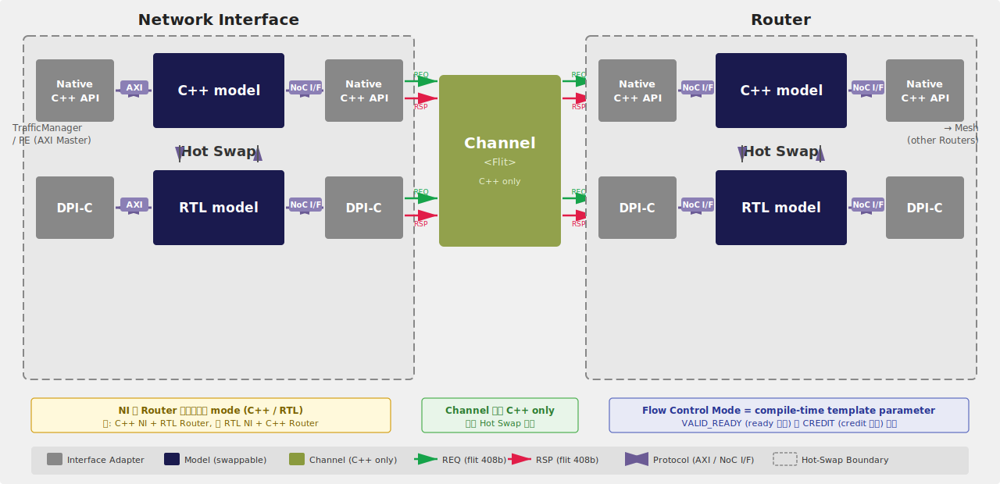

# Simulation Platform 規格

本文件定義 NoC CA Model 的模擬平台架構、配置參數、I/O pattern、public API、cycle model 與可替換邊界。

---

## 1. Overview

### 1.1 平台目標

NoC CA Model 服務兩大目標：

| 目標 | 說明 | 產物 |
|------|------|------|
| **Pre-silicon performance evaluation** | 高速模擬 + 參數掃描 | Statistics JSON |
| **RTL co-simulation golden reference** | CA Model output 作為 RTL 驗證的比對基準 | Memory State + Response Log |

核心流程：**同一組 Input Pattern 分別餵入 CA Model 和 RTL，CA Model 的 Output 當 Golden，與 RTL Output 比對。**

### 1.2 I/O 總覽

```
 ┌─────────────────┐                              ┌─────────────────┐
 │  INPUT PATTERNS  │                              │ OUTPUT PATTERNS  │
 ├─────────────────┤     ┌──────────────────┐      ├─────────────────┤
 │ 1. Config       │────►│                  │─────►│ 1. Memory State │
 │    (.json)      │     │  CA NoC Model        │      │    (.hex)       │
 │ 2. Memory Init  │────►│  (golden ref)    │─────►│ 2. Response Log │
 │    (.hex)       │     │                  │      │    (.json)      │
 │ 3. Traffic      │────►│                  │─────►│ 3. Cycle Trace  │
 │    (.json)      │     └──────────────────┘      │    (.vcd/.json) │
 └─────────────────┘                          ─────►│ 4. Statistics   │
                                                   │    (.json)      │
 同一組 Input ──────►  RTL Simulation (DUT)         └─────────────────┘
                              │
              GOLDEN vs ACTUAL → PASS / FAIL + diff report
```

| Pattern | 方向 | 格式 | 用途 | Golden 比對 |
|---------|------|------|------|:----------:|
| Config | INPUT | `.json` | 系統參數 | — |
| Memory Init | INPUT | `.hex` | 初始記憶體 | — |
| Traffic | INPUT | `.json` + `.hex` | 交易序列 + write data | — |
| Memory State | OUTPUT | `.hex` | 最終記憶體 | byte-exact |
| Response Log | OUTPUT | `.json` + `.hex` | 交易回應 + read data | cycle-accurate* |
| Cycle Trace | OUTPUT | `.vcd` / `.json` | 時序追蹤 | debug only |
| Statistics | OUTPUT | `.json` | 效能統計 | derived |

> *Cycle-accurate match 的前提：NocConfig 的 pipeline delay 參數與 RTL pipeline 深度正確校準。

---

## 2. Software / Hardware Architecture

```
┌─────────────────────────────────────────────────────────────────────┐
│ User Code / RTL Testbench                                            │
│   使用者撰寫的 test 程式或 SV testbench                              │
└────────────────────────────┬────────────────────────────────────────┘
                             ↓ calls
┌─────────────────────────────────────────────────────────────────────┐
│ NoC System Public API (noc_api.h)                                    │
│   5 Groups: Construction / Transaction / SimControl /               │
│             Metrics / Debug                                         │
└────────────────────────────┬────────────────────────────────────────┘
                             ↓ delegates to
┌─────────────────────────────────────────────────────────────────────┐
│ Internal Components                                                  │
│   Traffic Manager / Mesh / Router / NI / Channel / Memory / Stats    │
│                                                                     │
│   ┌─────────────────────── HOT-SWAP BOUNDARY ──────────────────┐   │
│   │  Router_Interface<Mode>  /  NI_Interface<Mode>              │   │
│   │  CA Router ↔ Router DPI Bridge  |  CA NI ↔ NI DPI Bridge       │   │
│   └─────────────────────────────────────────────────────────────┘   │
└────────────────────────────┬────────────────────────────────────────┘
                             ↓ DPI-C
┌─────────────────────────────────────────────────────────────────────┐
│ Co-Sim Bridge + RTL                                                  │
│   DPI-C functions / DPI-C Bridge / SystemVerilog modules                │
└─────────────────────────────────────────────────────────────────────┘
```


---

## 3. NocConfig（系統配置）

NocConfig 為**全局唯一的參數定義處**（single source of truth）。所有元件參數均從此取得。

### 3.1 參數表

| Parameter | Default | Description |
|-----------|---------|-------------|
| **Topology** | | |
| `MESH_COLS` | 4 | Number of mesh columns |
| `MESH_ROWS` | 4 | Number of mesh rows |
| `DEFAULT_LOCAL_PORTS` | 1 | Default LOCAL ports per router (0~4) |
| `NODE_LOCAL_PORTS` | `{}` | Per-node override (node_id → port count) |
| **Buffer** | | |
| `INPUT_BUFFER_DEPTH` | 4 | Router input buffer depth (flits) |
| `OUTPUT_BUFFER_DEPTH` | 2 | Router output buffer depth (0 = wire-through) |
| `NMU_BUFFER_DEPTH` | 2 | NMU injection buffer depth |
| **Flow Control** | | |
| `FLOW_CONTROL` | VALID_READY | Flow control mode (factory selects template) |
| `NUM_VC` | 1 | Number of virtual channels |
| **Pipeline Delay** | | |
| `ROUTING_DELAY` | 0 | RC stage extra cycles (0 = same-cycle) |
| `VC_ALLOC_DELAY` | 0 | VA stage extra cycles |
| `SW_ALLOC_DELAY` | 0 | SA stage extra cycles |
| `CREDIT_DELAY` | 1 | Credit return latency (cycles) |
| `CHANNEL_DELAY` | 1 | Link propagation latency (cycles) |
| **Allocator** | | |
| `VC_ALLOCATOR` | `"round_robin"` | VC allocator strategy (`round_robin` / `islip`) |
| `SW_ALLOCATOR` | `"qos_aware_rr"` | Switch allocator strategy (`qos_aware_rr` / `islip`) |
| **Traffic** | | |
| `MAX_OUTSTANDING` | 8 | Maximum outstanding transactions |
| `MAX_BURST_LEN` | 16 | Maximum AXI burst length |
| **NI** | | |
| `ROB_ENTRIES` | 32 | Reorder Buffer entries per NI |
| **Memory** | | |
| `MEMORY_READ_LATENCY` | 0 | Local memory read latency cycles (0 = ideal) |
| `MEMORY_WRITE_LATENCY` | 0 | Local memory write latency cycles (0 = ideal) |
| **Safety** | | |
| `REDUCTION_TIMEOUT` | 1000 | Reduction Sync timeout cycles (0 = disabled) |
| `CREDIT_TIMEOUT` | 10000 | Credit starvation detection cycles (0 = disabled) |
| `MULTICAST_TIMEOUT` | 10000 | Multicast handshake timeout cycles (0 = disabled) |
| `DEADLOCK_THRESHOLD` | 1000 | Forward progress timeout cycles |

**JSON 配置範例：**

```json
{
  "topology": { "mesh_cols": 4, "mesh_rows": 4, "default_local_ports": 1 },
  "router":   { "input_buffer_depth": 4, "num_vc": 1, "flow_control": "valid_ready" },
  "ni":       { "nmu_buffer_depth": 2, "rob_entries": 32 },
  "pipeline": { "routing_delay": 0, "channel_delay": 1 }
}
```

### 3.2 固定設計參數

以下參數為固定值，與 [Flit Format](02_flit.md) 一致，不可於模擬中調整：

| Parameter | Value | Description |
|-----------|-------|-------------|
| `FLIT_WIDTH` | 408 bits | Header 56 + Payload 352 |
| `AXI_DATA_WIDTH` | 256 bits | AXI data width |
| `AXI_ADDR_WIDTH` | 64 bits | AXI address width |
| `NODE_ID_WIDTH` | 8 bits | [7:4]=y, [3:0]=x |
| `QOS_WIDTH` | 4 bits | 16 QoS levels |
| `ECC_WIDTH` | 32 bits | SECDED |

---

## 4. I/O Pattern 定義

### 4.1 Input: Config

定義 NoC 拓撲、buffer 深度、flow control 等硬體參數。JSON 格式，見 §3.1。

**RTL 映射**：SV testbench 透過 DPI-C 讀取 JSON，或轉為 Verilog `parameter` / `define`。

### 4.2 Input: Memory Init

預載 Host Memory 和各 node 的 Local Memory 初始內容。使用 `$readmemh` 格式（`.hex`）。

```
@00000000 AB CD EF 01 02 03 04 05 ...
```

- 每個 node 一個 `.hex` 檔（可選，未指定則為 0）
- C++ 和 RTL 讀取相同的 `.hex` 檔

### 4.3 Input: Traffic

定義要執行的 AXI transaction 序列。JSON 格式。

| Field | Description |
|-------|-------------|
| `id` | Unique transaction identifier |
| `type` | `WRITE` / `READ` / `MULTICAST_WRITE` |
| `src_node` | Source NMU node ID |
| `dst_addr` | 64-bit AXI address (`[39:32]`=node_id, `[31:0]`=local_addr) |
| `dst_nodes` | Multicast destination node list (MULTICAST_WRITE only) |
| `data_file` | Path to `.hex` file containing write data |
| `data_size` | Transfer size (bytes) |
| `axi_id` | AXI transaction ID |
| `burst_len` | AXI burst length (beats) |
| `inject_cycle` | Absolute cycle number or `"after:<txn_id>"` |

### 4.4 Output: Memory State

所有 transaction 完成後各 node Local Memory dump。`.hex` 格式，byte-level exact match。

### 4.5 Output: Response Log

每筆 transaction 的 AXI response 記錄。JSON 格式。

| 比對欄位 | 方式 |
|---------|------|
| `status` | Exact match（OKAY / SLVERR / DECERR） |
| `b_resp` | Exact match |
| `r_data_file` | Byte-level exact match |
| `complete_cycle` | Cycle-accurate match（需 pipeline delay 校準） |

### 4.6 Output: Cycle Trace（可選）

Debug 用途。每 cycle 記錄 router/NI/channel 狀態。VCD 或 JSON trace 格式。通常不做自動比對。

### 4.7 Output: Statistics

效能統計（latency、throughput、buffer occupancy）。JSON 格式。不用於 golden 比對。

---

## 5. NoC System Public API

### 5.1 API 分組總覽

| Group | 名稱 | 主要功能 |
|-------|------|---------|
| A | Construction & Configuration | NocConfig 載入、Memory 初始化 |
| B | Transaction | submit / completion 查詢 / callback |
| C | Simulation Control | process_cycle / run / run_until_idle / run_all |
| D | Metrics & Verification | get_metrics / verify |
| E | Debug & Output | get_router / dump_state / generate_golden |

### 5.2 Group A: Construction & Configuration

| Function | Description |
|----------|-------------|
| `NoC System(const NocConfig&)` | 建構系統 |
| `load_config(json_path) → NocConfig` | 從 JSON 載入配置（static） |
| `load_memory(hex_dir)` | 載入 Memory Init |
| `load_traffic(json_path)` | 載入 Traffic |
| `load_host_memory(addr, data, len)` | 直接寫入 Host Memory |
| `load_local_memory(node_id, addr, data, len)` | 直接寫入 Local Memory |

### 5.3 Group B: Transaction

回傳 `TxnHandle`（uint32_t），用於追蹤 completion。涵蓋 transaction 提交與完成查詢。

| Function | Description |
|----------|-------------|
| `submit_write(addr, data, len, axi_id)` | 提交 write transaction |
| `submit_read(addr, len, axi_id)` | 提交 read transaction |
| `submit_multicast_write(addr, data, len, dst_nodes)` | 提交 multicast write |
| `is_complete(h)` | 是否完成 |
| `all_complete()` | 全部完成 |
| `get_status(h) → TxnStatus` | 狀態查詢 |
| `get_read_data(h)` | 取得 read data |
| `set_completion_callback(cb)` | 註冊完成 callback |

**TxnStatus**: `PENDING` → `INJECTING` → `WAITING_RESPONSE` → `COMPLETE` / `ERROR` / `TIMEOUT`

### 5.4 Group C: Simulation Control

| Function | Description |
|----------|-------------|
| `process_cycle()` | 推進 1 cycle（8 phases） |
| `run(N)` | 推進 N cycles |
| `run_until_idle(max_cycles)` | 直到 network idle |
| `run_all()` | 執行所有 loaded traffic 至完成 |
| `current_cycle()` | 目前 cycle 數 |

> **Implementation Note：** `process_cycle()` 內部依序呼叫：所有 Router `tick()` → `wire_all()` → 所有 Router `post_wire()` → 所有 NI `tick()`。此順序保證 8-phase 因果正確性。

**Deadlock Detection：** `run_until_idle()` 和 `run_all()` 內建 deadlock detection。Forward progress = 至少一個 Router input buffer 發生 pop。連續 `DEADLOCK_THRESHOLD` cycles 無 forward progress → warning + abort。

### 5.5 Group D & E

| Function | Description |
|----------|-------------|
| `get_metrics()` | 取得 Metrics Collector |
| `verify()` | 產生 VerificationReport |
| `get_router(coord)` | Read-only 存取 Router |
| `get_ni(coord)` | Read-only 存取 NI |
| `dump_state(ostream)` | Dump 內部狀態 |
| `generate_golden(output_dir)` | 產生所有 output patterns |

### 5.7 使用範例

```cpp
// 從檔案載入 → 執行 → 產生 golden
auto config = NoC System::load_config("patterns/config.json");
NoC System system(config);
system.load_memory("patterns/");
system.load_traffic("patterns/traffic.json");
system.run_all();
system.generate_golden("golden/");
```

### 5.8 RTL Testbench 對應

```
SV Testbench:
  1. 讀取 Config JSON（via DPI-C） → 設定 parameters
  2. $readmemh() 載入 Memory Init
  3. 讀取 Traffic JSON → 驅動 AXI transactions
  4. 執行 simulation
  5. Dump RTL Memory State → 比對 golden
```

---

## 6. 8-Phase Cycle Model

### 6.1 Phase 總覽

| Phase | 名稱 | 動作 | RTL 映射 |
|-------|------|------|---------|
| 1 | Sample | Input FF latch：`in_valid && out_ready` → push to buffer | `posedge clk` |
| 2 | Clear Inputs | 清除 input 信號（防止重複 sample） | Model housekeeping |
| 3 | Update Ready | `out_ready = !buffer.full()`（combinational） | `assign` |
| 4 | Route & Forward | RC → VA → SA → ST pipeline + credit return 產生 | Combinational pipeline |
| 5 | Wire All | Channel\<T\> 交換所有元件 output → 對端 input | Wire connections |
| 6 | Clear Accepted | `out_valid && in_ready` → 清除 output | `posedge clk` |
| 7 | Credit Update | 上游收到 credit → counter +1（Credit-Based mode；Valid/Ready 為 no-op） | `posedge clk` |
| 8 | NI Process | NMU/NSU 處理 AXI ↔ flit conversion | NI pipeline |

Phase 1-4 封裝在 `Router_Interface::tick()` 內部，Phase 6-7 為 `post_wire()` 處理，Phase 8 為 `NI_Interface::tick()`。

### 6.2 Phase 因果關係

```
Cycle N-1 Phase 5 ──────────► Cycle N Phase 1 (Sample)
                                  │
                              Phase 2 (Clear) → Phase 3 (Ready)
                                                    │
                                                Phase 4 (Route & Forward)
                                                    │ out_valid/flit + credit
                                                Phase 5 (Propagate via Channel)
                                                    │ in_ready visible
                                                Phase 6 (Clear Accepted)
                                                    │ buffer slot 釋放
                                                Phase 7 (Credit Release) → 上游 credit +1
                                                    │
                                                Phase 8 (NI Process)
                                                    │ NI output 設定
                                                ──► 下一 cycle Phase 5 propagate
```

### 6.3 RTL posedge clk 映射

CA Model 將 RTL 的並行行為拆為 8 個循序 phase，以 ordering 保證因果正確：

| RTL posedge clk（Sequential） | CA Model Phase |
|-------------------------------|-----------|
| Input FF latch | Phase 1 |
| Output FF update | Phase 6 |
| Credit counter update | Phase 7 |

| RTL combinational | CA Model Phase |
|-------------------|-----------|
| `out_ready = ~buffer_full` | Phase 3 |
| RC → VA → SA → ST pipeline | Phase 4 |
| Wire propagation | Phase 5 |

### 6.4 Phase 4 Pipeline State Machine

Phase 4 使用 per-flit state machine，每個 head flit 在各 sub-stage 等待 `*_DELAY` cycles：

```
RC ──(ROUTING_DELAY)──► VA ──(VC_ALLOC_DELAY)──► SA ──(SW_ALLOC_DELAY)──► ST → DONE
```

- Delay 期間 flit 佔 input buffer slot，同 VC 後續 flit 被 back-pressure
- Body/tail flit 沿 path lock 直接進入 ST（跳過 RC/VA/SA）
- 所有 delay = 0 時等效 single-cycle pipeline
- SA 失敗（contention）→ 下 cycle 重試，不推進 stage

### 6.5 Credit Return 時序（Credit-Based Mode）

| 事件 | Phase | 說明 |
|------|-------|------|
| Flit 被 downstream 接受 | Phase 1 | `input_buffer.push(flit)` |
| Input buffer slot 釋放 | Phase 4 | flit 被 crossbar consume → pop |
| Credit return 產生 | Phase 4 | Combinational：pop 觸發 `credit[vc] = true` |
| Credit 傳播 | Phase 5 | `wire_all()` 交換至上游 |
| 上游 counter +1 | Phase 7 | `credit_counter[vc]++` |

**Credit return latency = 1 cycle**。上游在 Cycle N+1 Phase 4 即可使用歸還的 credit 發送新 flit。

**Credit 不變量：**
```
upstream.credit[vc] + downstream.buffer.count(vc) + in_flight(vc) == INPUT_BUFFER_DEPTH_PER_VC
```

Valid/Ready mode 不使用 explicit credit。`ready` 在 Phase 3 combinational 設定，Phase 7 為 no-op。

### 6.6 NI Injection Latency

NI 在 Phase 8 設定 output → 下一 cycle Phase 5 傳播至 Router → 再下一 cycle Phase 1 Router sample。NI injection 相對 Router-Router 多出 **1 cycle 額外延遲**。

---

## 7. Channel\<T\>（Link Model）

Channel 是帶有可配置延遲的 pipeline，模擬 Router ↔ Router 與 NI ↔ Router 之間的 link propagation delay，取代 zero-cycle hard-wired 直連。

### 7.1 Latency 行為

| CHANNEL_DELAY | 行為 | RTL 映射 |
|---------------|------|---------|
| 0 | Zero-cycle（combinational wire） | `assign` 直連 |
| 1 | 下一 cycle 可見（預設） | 1-stage pipeline register |
| N>1 | N cycle 後可見 | N-stage pipeline register |

> **Implementation Note：** `Channel<T>` 內部使用 `std::deque<T>` 模擬 pipeline。`CHANNEL_DELAY=0` 時退化為 pointer alias（zero-copy）。

### 7.2 Phase 5 中的 Channel 處理順序

Phase 5 `wire_all()` 必須嚴格遵守以下順序：

```
Phase 5a: ReadInputs   — Latch 上 cycle 送入的資料
Phase 5b: WriteOutputs — Pipeline shift，最舊資料到 output
Phase 5c: Deliver      — Channel output → receiver set_input
Phase 5d: Send         — Component get_output → Channel input
```

> 注意順序：若 Send 先於 ReadInputs，latency=1 的 channel 會表現為 latency=0。

### 7.3 Mesh 中的 Channel

Mesh 持有兩組 Channel：

| Channel 組 | 連接 | 說明 |
|-----------|------|------|
| `router_channels_` | Router ↔ Router | Mesh 方向 link（N/S/E/W） |
| `ni_channels_` | NI ↔ Router | LOCAL port link |

每條 Channel 攜帶 `src`/`dst` 元件指標、port index、Channel type（REQ/RSP）。

---

## 8. Traffic Manager（中央協調器）

Traffic Manager 位於 NoC System API 與 Mesh 之間，管理 transaction 的完整生命週期。

### 8.1 架構定位

```
NoC System Public API
     ↓ submit_write / submit_read / load_traffic
Traffic Manager
     ├── Transaction → Packet → Flit 拆解
     ├── Injection Queue (per NMU)
     ├── Outstanding Transaction Tracking
     ├── Completion Collection (from NMU RoB)
     ├── Register Expected (submit → Scoreboard)
     └── Statistics Aggregation
     ↓ inject flit to NMU
NMU (via Mesh)
```

### 8.2 Transaction Lifecycle

```
PENDING ──► INJECTING ──► WAITING_RESPONSE ──► COMPLETE / ERROR / TIMEOUT
  │            │                │                    │
submit 時   flits 開始注入   所有 flits 已注入      收到 B/R response
建立        到 NMU           等待 response          status 確定
```

### 8.3 每 Cycle 行為

Traffic Manager 的 `tick(current_cycle)` 每 cycle 執行：

1. **Injection scheduling**：檢查 `inject_cycle`，將到期 transaction 的 flits 注入 NMU injection buffer
2. **Completion collection**：從 NMU RoB 收集已完成的 response
3. **Register expected**：submit 時將 expected outcome 送入 Scoreboard
4. **Statistics update**：更新 per-transaction latency、per-router throughput

### 8.4 與 Scoreboard 的交互

| 事件 | Traffic Manager 動作 | Scoreboard 動作 |
|------|--------------------|--------------------|
| submit_write | 記錄 addr + data | register_expected（記錄預期寫入值） |
| submit_read | 記錄 addr + src data | register_expected（記錄預期 read data） |
| Write complete | 收到 B response | check_actual（即時比對 dest memory） |
| Read complete | 取得 rdata | check_actual（即時比對 expected vs actual） |

---

## 9. Abstract Interface & Hot-Swap

### 9.1 Abstract Interface 合約

Router 和 NI 均實作抽象介面，Simulation Driver 透過 wiring loop 連接所有元件，無需區分 CA Model 或 RTL 實作。

```
┌──────────────┐                           ┌──────────────┐
│  CA Router        │── Router_Interface<M> ──│Router DPI Bridge│
│  (CA Model)      │                           │  (DPI-C)     │
└──────────────┘                           └──────────────┘
         ▲           Simulation Driver           ▲
         │           (Mesh wiring loop)          │
         ▼                                       ▼
┌──────────────┐                           ┌──────────────┐
│  CA NI            │── NI_Interface<M> ──────│  NI DPI Bridge  │
│  (CA Model)      │                           │  (DPI-C)     │
└──────────────┘                           └──────────────┘
```

**核心規則：**

1. Interface 是合約 — `Router_Interface` 和 `NI_Interface` 定義唯一的元件間通訊方式
2. Flow control mode 是 compile-time 參數 — 整個系統統一使用同一種 mode
3. 不帶多餘信號 — Valid/Ready 無 credit 信號；Credit 無 ready 信號
4. NI-Router 與 Router-Router 使用相同介面

### 9.2 Router_Interface\<Mode\>

| Method | Description |
|--------|-------------|
| `num_ports()` | Port 數（mesh + local） |
| `get_output(port, ch)` | 取得指定 port 的 output 信號 |
| `set_input(port, ch, in)` | 設定指定 port 的 input 信號 |
| `tick()` | 推進一個 cycle（Phase 1-4） |

### 9.3 NI_Interface\<Mode\>

| Method | Description |
|--------|-------------|
| `get_output(ch)` | 取得面向 Router 的 output 信號 |
| `set_input(ch, in)` | 設定來自 Router 的 input 信號 |
| `tick()` | 推進一個 cycle（Phase 8） |

### 9.4 PortOutput 信號方向

每個 port 的 `PortOutput` 包含該元件**主動驅動**的所有信號：

| Mode | PortOutput 內容 | 說明 |
|------|----------------|------|
| VALID_READY | valid, flit, ready | ready = 本元件可接收對端 flit |
| CREDIT | valid, flit, credit[NUM_VC] | credit = 本元件歸還的 per-VC credit bits |

信號交換對稱：A 的 `get_output` → B 的 `set_input`，反之亦然。

### 9.5 Factory Pattern（Template Instantiation）

Flow control mode 透過 JSON 指定，啟動時由 factory 選擇 template instantiation（類似 RTL `parameter` elaboration）：

```
NoC SystemBase (type-erased)
    ├── NoC SystemImpl<VALID_READY>
    └── NoC SystemImpl<CREDIT>

create_noc_system(config) → switch(config.flow_control) → 對應 NoC SystemImpl
```

### 9.6 Hot-Swap 機制



| Substitution Mode | Router | NI | Use Case |
|-------------------|--------|----|----------|
| Standalone | CA Router | CA NI | 高速效能模擬 |
| NI RTL | CA Router | NI DPI Bridge | NI RTL 驗證 |
| Router RTL | Router DPI Bridge | CA NI | Router RTL 驗證 |
| Full RTL | Router DPI Bridge | NI DPI Bridge | 系統級 co-sim |

**Hot-Swap 約束：**
- 替換前必須 drain 目標元件的所有 Channel pipeline（排空 in-flight flits）
- 不支援 in-flight flit 的跨實作遷移（CA Model state ↔ RTL register 格式不同）
- 只能在 network quiescent 或目標元件 Channel 已排空時進行

### 9.7 不可替換元件

| 元件 | 原因 |
|------|------|
| Traffic Manager | 中央協調，不需替換 |
| Mesh topology | 固定 mesh，由 config 參數化 |
| Channel | Link model，不需替換 |
| Scoreboard / Metrics Collector | 驗證（online per-txn tracking）與統計邏輯，CA Model only |
| Host Memory / Local Memory | 行為模型，不需替換 |

---

## 10. DPI-C Bridge

DPI-C bridge 為 thin wrapper，提供 SystemVerilog 與 CA Model 的互操作介面。

### 10.1 Transaction-Level API

用於 CA Model 獨立執行，產生 golden output。SV testbench 只做 submit + step + response。

| Function | Description |
|----------|-------------|
| `noc_init(json_path) → handle` | 建立 NoC System |
| `noc_destroy(handle)` | 銷毀 |
| `noc_submit_write(h, addr, data, len) → TxnHandle` | 提交 write |
| `noc_submit_read(h, addr, len) → TxnHandle` | 提交 read |
| `noc_step(h, cycles)` | 推進 N cycles |
| `noc_get_response(h, buf, size) → type` | 取得 response |
| `noc_pending_count(h) → count` | 查詢 pending 數 |

### 10.2 Signal-Level API

用於 hot-swap co-sim。RTL proxy 每 cycle 透過 signal-level API 讀寫 port 信號，與 CA mesh 中的其他元件互動。

| Function | Description |
|----------|-------------|
| `noc_set_port_input(h, node, port, ch, valid, flit, ready_or_credit)` | RTL → CA Model |
| `noc_get_port_output(h, node, port, ch, &valid, flit, &ready_or_credit)` | CA Model → RTL |
| `noc_get_num_ports(h, node) → count` | 查詢 port 數 |

`ch`: 0=REQ, 1=RSP。`ready_or_credit`: VR mode → ready bit；Credit mode → credit bitmask。

### 10.3 Memory Model

| 模式 | Memory 歸屬 | 同步機制 |
|------|-----------|---------|
| CA as golden | CA Model 維護 | RTL memory 由 CA Model shadow |
| RTL as primary | RTL memory 為 primary | CA Model 每 cycle 讀取 RTL state |
| Independent | 各自維護 | 比對 response data 驗證一致性 |

---

## 11. 模擬範圍與限制

### 11.1 模擬範圍

| 項目 | 模擬 | 說明 |
|------|:----:|------|
| Cycle-accurate timing | Y | 8-phase pipeline |
| Wormhole switching | Y | Path lock/release FSM |
| Credit-based flow control | Y | Per-VC credit (Credit-Based mode) |
| Valid/Ready handshake | Y | AXI-style (Valid/Ready mode) |
| AXI protocol (AW/W/AR/B/R) | Y | Burst, reorder |
| QoS-Aware arbitration | Y | QoS + Round-Robin |
| ECC generate/check | Y | SECDED 行為模型 |
| Multicast + In-Network Reduction | Y | |
| Configurable channel delay | Y | Channel\<T\> |
| Deadlock detection | Y | N cycles 無 progress → abort |
| Clock domain crossing | N | 全域同步時脈 |
| Power / physical wire delay | N | |
| Reset sequence | N | 假設初始狀態已就緒 |

### 11.2 Timing 抽象

| 硬體行為 | 模擬方式 |
|---------|---------|
| Combinational logic delay | 同 phase 內瞬間完成 |
| Wire propagation delay | `CHANNEL_DELAY` 參數 |
| FF setup/hold / Metastability | 不模擬（同步假設） |
| Pipeline register | Channel delay + output buffer |

### 11.3 已知限制

1. **Pipeline delay 校準**：Phase 4 per-flit state machine 的 delay 參數需與 RTL pipeline 深度正確校準，才能達到 cycle-accurate match
2. **AXI slave 無 stall**：AXI slave 總是就緒，不模擬 AXI slave stall
3. **Memory latency**：可透過 `MEMORY_READ_LATENCY` / `MEMORY_WRITE_LATENCY` 配置，預設 0 = ideal

---

## 12. Related Documents

- [System Overview](01_overview.md)
- [Flit Format](02_flit.md) — 固定參數基準
- [Router](03_router.md) — 8-phase pipeline、CA Router pipeline stages
- [Network Interface](04_network_interface.md) — NMU/NSU、CA NI functions
- [Verification](09_verification.md) — Golden 驗證、效能指標、測試策略

---

## Change Log

| Version | Date | Description |
|---------|------|-------------|
| 1.0 | 2026-03-09 | Initial release |
